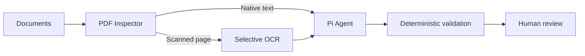
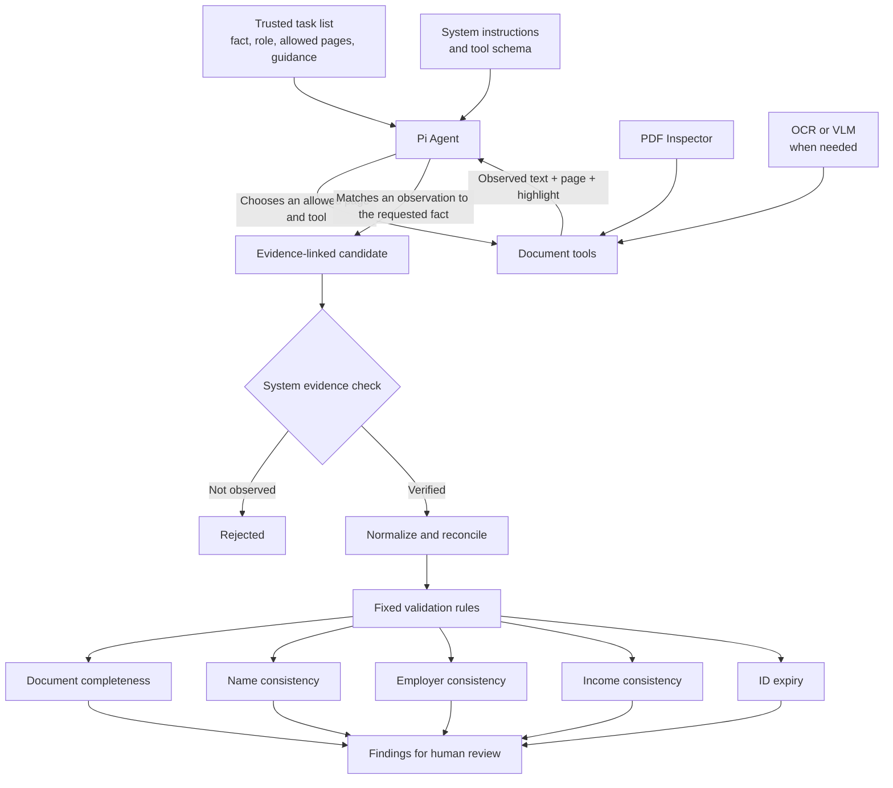

# Financial Document AI Agent

Financial Document AI Agent is a project for AI-assisted review of synthetic German personal-loan documents.

## Technical stack

- **Runtime:** TypeScript, Node.js 22, pnpm workspaces
- **Services:** Fastify API, pg-boss Worker, React and Vite Review Workbench
- **Data:** PostgreSQL with Drizzle ORM, S3-compatible object storage with MinIO locally
- **Document AI:** PDF Inspector, PDF.js, PP-OCRv6 Small, provider-neutral VLM gateway, Pi Agent
- **Contracts and validation:** TypeBox, JSON Schema, versioned deterministic TypeScript rules
- **Testing:** Vitest, Testcontainers, Playwright
- **Deployment:** Docker Compose

## Workflow



### How the Agent uses document evidence



The Agent uses the task's role and guidance—for example, “monthly net pay from the payslip”—to choose among observed values. It can only submit a value already returned by an authorized document tool on the same page. Trusted code then verifies the source, adds the field meaning and type, normalizes the value, and runs the fixed rules.

## Quick start

Choose either the complete Docker Compose environment or local pnpm development.

### Option 1: Docker Compose

Prerequisites: Docker Desktop, Node.js 22.19 or later, and pnpm 11.3.0.

1. Install Docker Desktop for your operating system.
2. Start Docker Desktop and wait until the Docker engine is running.
3. Verify Docker and Compose:

```bash
docker version
docker compose version
```

The pnpm commands below are wrappers around Docker Compose. Docker still runs PostgreSQL, MinIO, database migrations, the API, the Worker, and the Review Workbench.

```bash
pnpm demo:up
pnpm demo:load
```

`demo:load` prints the Review Workbench URL. Stop the environment while preserving its data with `pnpm demo:down`; permanently remove its containers, volumes, and generated local credentials with `pnpm demo:reset`.

Run the isolated offline acceptance path with:

```bash
pnpm demo:acceptance
```

The acceptance command forces the fake Agent, fixture VLM, and offline mode. It does not forward provider credentials from an ignored local `.env`.

### Option 2: Local pnpm development

Prerequisites: Node.js 22.19 or later, pnpm 11.3.0, PostgreSQL, and MinIO. Configure the required values from [`.env.example`](.env.example), then run:

```bash
pnpm install
pnpm build
pnpm db:migrate

pnpm dev:api
pnpm dev:worker
pnpm dev:web
```

Run the three development processes in separate terminals. Build shared packages again after source changes when necessary.

## Verification

```bash
pnpm check
pnpm test:integration
```

## Agent diagnostics

Enable `FINDOC_SYNTHETIC_DEMO=true` and `AGENT_DIAGNOSTICS=true`, then print the latest synthetic Agent trace:

```bash
pnpm agent:trace
```

To inspect a specific case:

```bash
pnpm agent:trace -- CASE_UUID
```

The trace includes the Agent session, safe tool activity, references, budgets, usage, and report metadata. It excludes document contents, page images, credentials, raw model messages, and chain-of-thought.

## Dataset and evaluation

The golden dataset lifecycle is documented in [`datasets/golden/README.md`](datasets/golden/README.md). Common checks are:

```bash
pnpm dataset:validate
pnpm dataset:inspect
pnpm evaluate:offline -- RELEASE ACTUAL_RUN_JSON
```

Live evaluation requires an explicit release subset and USD cost budget. Do not modify frozen truth to make a regression pass. Exact historical measurements belong in [`EVALUATION_RESULTS.md`](EVALUATION_RESULTS.md), not in this README.

## Optional real OCR

Real OCR never downloads models during case processing. Provision and verify the pinned runtime explicitly:

```bash
pnpm ocr:setup -- linux-arm64
pnpm ocr:verify -- linux-arm64
pnpm ocr:smoke
pnpm ocr:image-smoke
```

Use `compose.ocr.yaml` with `compose.yaml` to enable the read-only OCR asset mounts. Linux ARM64 synthetic PDF/JPEG/PNG paths have acceptance evidence; Linux x64 native execution and broader corpus measurement remain pending.

## Documentation map

- [`specs/INDEX.md`](specs/INDEX.md) — authoritative specification map, terminology, and lifecycle.
- [`LIMITATIONS.md`](LIMITATIONS.md) — current-release limitations and production-readiness boundary.
- [`BACKLOG.md`](BACKLOG.md) — accepted pending work and evidence gaps.
- [`AGENTS.md`](AGENTS.md) — current implementation context and repository operating rules.
- [`EVALUATION_RESULTS.md`](EVALUATION_RESULTS.md) — versioned measurements and acceptance evidence.
- [`RELEASE_NOTES.md`](RELEASE_NOTES.md) — application release summary.

The package version (`0.1.0`) and golden dataset release (`v0.1.4`) are independent.
