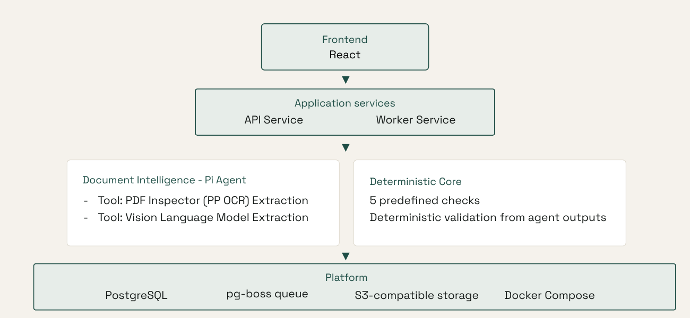

# Financial Document AI Agent

## Introduction

Financial Document AI Agent is a TypeScript monorepo that demonstrates how to build a safe, evidence-linked AI Agent for document review. It uses:
- [Pi Agent](https://github.com/earendil-works/pi) as a reasoning engine
- [PDF Inspector](https://github.com/firecrawl/pdf-inspector) to extract text and images
- Integrated OCR and vision-language models to read scanned documents

## Workflow

The workflow is designed for a human-in-the-loop review of financial documents.

```
Application & Documents Received
                │
                ▼
┌────────────── AI Agent Review ──────────────┐
│                                             │
│  Identify required checks                   │
│       │                                     │
│       ▼                                     │
│  Find the relevant documents                │
│       │                                     │
│       ▼                                     │
│  Read text ──► Use OCR/VLM when needed      │
│       │                                     │
│       ▼                                     │
│  Extract values with source evidence        │
│       │                                     │
│       ▼                                     │
│  Request deterministic validation           │
│       │                                     │
│       ▼                                     │
│  Prepare evidence-linked review findings    │
│                                             │
└─────────────────────────────────────────────┘
                │
                ▼
          Human Review
                │
                ▼
       Final Review Outcome
```

## Architecture Overview



## Installation & Usage

### Prerequisites

- Node.js 22.19+
- pnpm 11.3+
- Docker with Docker Compose
- An OpenAI API key

### Run the demo

```bash
pnpm install
cp .env.example .env
```

Update these values in `.env`:

```dotenv
AGENT_MODEL=openai/gpt-5.6-terra
VLM_MODE=live
VLM_MODEL=openai/gpt-5.6-terra
OPENAI_API_KEY=your_api_key_here
PI_OFFLINE=0
```

Then start the services and load the synthetic demo cases:

```bash
pnpm demo:up
pnpm demo:load
```

Stop the demo when finished:

```bash
pnpm demo:down
```

## Product demo

https://github.com/user-attachments/assets/56991e25-4d2a-4db0-9169-7e0aa826a4ca
