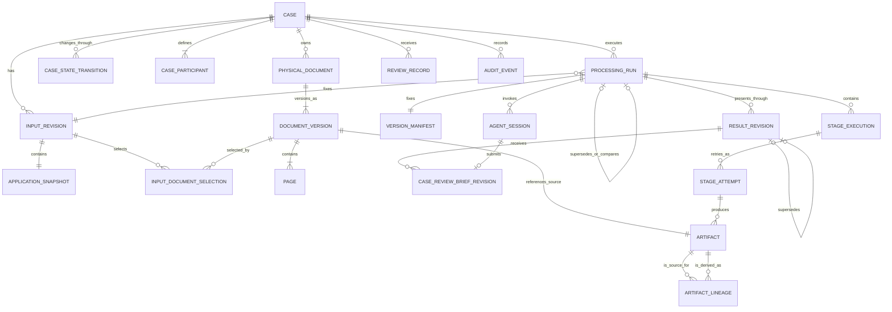
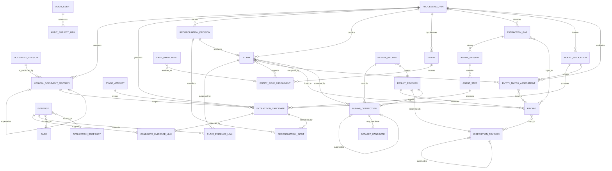

# Financial Document AI Agent Data Model Specification

Document ID: `DAT`

Version: 2.1.0

Status: Approved

Last updated: 2026-09-04

## 1. Purpose

This specification defines the domain entities, identities, relationships, lifecycle semantics, provenance, revision model, and persistence invariants for Financial Document AI Agent.

It defines the meaning of stored data, not physical table layouts, API representations, extraction algorithms, validation-rule behavior, user-interface behavior, or retention policy.

## 2. Authority and Scope

This document owns:

1. Case, input, artifact, physical-document, page, and logical-document semantics.
2. Processing-run, stage-execution, and stage-attempt identity and lifecycle relationships.
3. Extraction candidate, evidence, claim, entity, role, and entity-resolution semantics.
4. Extraction-gap, finding, recommended-disposition, Case Review Brief, correction, review, and audit-record semantics.
5. Immutability, revision, lineage, current-view, and deletion-marker invariants.
6. The minimum version manifest required for reproducible processing.

Related authorities are:

1. [`INDEX.md`](INDEX.md) for shared terminology and controlled vocabularies.
2. [`PRODUCT_AND_SCOPE.md`](PRODUCT_AND_SCOPE.md) for product behavior and exclusions.
3. [`SYSTEM_ARCHITECTURE.md`](SYSTEM_ARCHITECTURE.md) for component and persistence boundaries.
4. Future component specifications for algorithms that create these records.
5. Future `API_CONTRACTS.md` for transport schemas and endpoint behavior.
6. Future `SECURITY_AND_LIMITATIONS.md` for access, retention, erasure, and data-protection controls.

The [migration source specification](../Intelligent_Document_Processing_Agent_Specification.md) is non-authoritative for data-model concerns after this document is approved.

`DAT-REQ-001` Every persisted domain record must have a stable identifier that is independent of a display label, array position, or mutable business value.

`DAT-REQ-002` Identifiers must be unique within their entity type and must not be reused after logical deletion or expiry.

`DAT-REQ-003` Every case-scoped record must be directly or transitively attributable to exactly one case.

`DAT-REQ-004` Timestamps representing domain events must be stored as timezone-aware instants; display timezone is not domain state.

## 3. Aggregate Overview

### 3.1 Case, inputs, and workflow

### 3.2 Document understanding, validation, and review

The notation means:

| Symbol | Meaning |
|---|---|
| `||` | Exactly one |
| `o|` | Zero or one |
| `|{` | One or more |
| `o{` | Zero or more |

The principal relationship paths are:

1. A Case owns uploaded Physical Documents. Each document has immutable Document Versions, and an Input Revision selects versions through `INPUT_DOCUMENT_SELECTION`.
2. Each Processing Run fixes exactly one Input Revision and one Version Manifest and exposes immutable machine or review results through Result Revisions.
3. A Document Version owns ordered Pages and references one immutable source Artifact. Derived artifacts retain lineage through `ARTIFACT_LINEAGE`.
4. Stage Attempts produce immutable candidates and artifacts. Retries do not replace earlier attempts.
5. A Reconciliation Decision records considered Candidates, selection rationale, and an optional resulting Claim. Candidate and Claim evidence use separate typed links.
6. Claims support case-local Entity and Role hypotheses. Match assessments compare those hypotheses but remain separate from Findings.
7. Findings belong to one Result Revision and consume Claims, match assessments, and gaps. Each complete Result Revision has exactly one Disposition Revision.
8. Human Corrections create a new review Result Revision over the machine baseline or prior review revision; they do not overwrite machine outputs.
9. Audit Events are case-owned and reference affected records through `AUDIT_SUBJECT_LINK` without owning those records.

Note: Claim-to-finding and finding-to-disposition associations also require explicit input-link records in the relational implementation so provenance can carry relationship-specific metadata. The diagrams define domain cardinality and lineage, not API nesting or final table names.

## 4. Common Record Semantics

`DAT-REQ-005` Every immutable domain record must identify its creation time and the actor or system component responsible for its creation.

`DAT-REQ-006` A machine-created record must identify the processing run and, when applicable, the stage attempt that created it.

`DAT-REQ-007` A human-created record must identify an authenticated actor reference and must not rely on a mutable display name as identity.

`DAT-REQ-008` Domain records must distinguish stable identity, immutable revision identity, and current projection when all three concepts apply.

`DAT-REQ-009` A current projection must be derivable from immutable source records and explicit supersession relationships.

`DAT-REQ-010` A mutable cache or projection must not become the sole authoritative copy of a material value, finding, disposition, correction, or audit event.

`DAT-REQ-011` Optional data must be represented as absent or by an explicit domain state; empty strings, zeroes, and placeholder dates must not silently mean unknown.

`DAT-REQ-012` Domain enums must use stable machine values; localized or user-facing labels must not be persisted as their identity.

## 5. Case and Input Revisions

A Case is the document-review container for one synthetic applicant scenario. It is not a loan, account, credit decision, KYC decision, or AML decision.

`DAT-REQ-013` A case must have one stable case identifier and exactly one case-lifecycle value from `IDX` section 12.1.

`DAT-REQ-014` A case must record creation time, current lifecycle projection, and the identifiers needed to correlate its audit history.

`DAT-REQ-015` Case lifecycle changes must be represented by durable transition history; updating the current lifecycle projection must not erase earlier states.

`DAT-REQ-169` A case-state transition must record prior state, new state, transition reason, time, actor or component, and the active processing run when applicable.

`DAT-REQ-016` A case must support multiple immutable input revisions.

`DAT-REQ-017` An input revision must identify one structured application snapshot and the complete set of document versions selected as inputs.

`DAT-REQ-018` Adding, replacing, or withdrawing a physical document or materially changing structured application data must create a new input revision rather than mutate an input revision used by an existing run.

`DAT-REQ-019` A structured application snapshot must retain its schema identifier, schema version, canonical content hash, and immutable content or artifact reference.

`DAT-REQ-020` Structured application fields used as claims must be addressable by JSON Pointer within the immutable snapshot.

`DAT-REQ-021` An input revision may reference a prior revision as its predecessor, but its meaning must not depend on replaying undocumented database updates.

`DAT-REQ-170` An input-document selection must link one input revision to one immutable document version and must be unique for that physical document within the input revision.

`DAT-REQ-171` A withdrawn document must be absent from a later input revision through its selection set; withdrawal must not delete the physical document, its versions, or their earlier selections.

## 6. Artifacts, Physical Documents, and Pages

An Artifact is immutable stored content plus integrity and lineage metadata. Large bytes belong in object storage; their domain metadata belongs in PostgreSQL.

`DAT-REQ-022` An artifact record must contain an immutable object identity or object key, SHA-256 checksum, byte size, detected media type, artifact kind, and creation time.

`DAT-REQ-023` An artifact must record whether it is a source or derived artifact.

`DAT-REQ-024` A derived artifact must reference its immediate source artifact or artifacts and the operation or stage attempt that derived it.

`DAT-REQ-025` Artifact lineage must be acyclic and must resolve every derived artifact to at least one case input.

`DAT-REQ-026` Repeated content may be physically deduplicated, but case membership, authorization, and provenance must remain explicit and must not be inferred solely from checksum equality.

`DAT-REQ-027` An artifact record must not contain unrestricted document bytes in an ordinary relational domain column.

`DAT-REQ-028` A physical document must belong to exactly one case and must contain one or more immutable document versions.

`DAT-REQ-029` A document version must preserve the submitted filename as untrusted display metadata and must not use it as identity or authoritative media type.

`DAT-REQ-030` A document version must record intake results including detected media type, integrity state, readability state, and malware-scan state when known.

`DAT-REQ-172` Each document version must reference exactly one immutable submitted source artifact and preserve its submitted filename, intake results, creation time, and predecessor version when applicable.

`DAT-REQ-031` A PDF document version must own an ordered sequence of pages numbered from one; a JPEG or PNG document version represents one page.

`DAT-REQ-032` A page must retain document-version identity, page number, dimensions, rotation, and the source or derived artifacts required to reproduce displayed content.

`DAT-REQ-033` Page dimensions and rotation must identify the coordinate space to which original evidence coordinates apply.

## 7. Logical Documents and Boundary Revisions

`DAT-REQ-034` A logical document must identify a contiguous inclusive page range within exactly one document version.

`DAT-REQ-035` A logical document must have a supported business-document type or an explicit unknown or unsupported classification defined by the document-processing specification.

`DAT-REQ-036` A machine logical-document revision must record its classifier or grouping provenance, raw confidence metadata, and alternatives when produced.

`DAT-REQ-037` Logical-document boundaries from distinct processing runs must remain independently traceable.

`DAT-REQ-038` A reviewer boundary correction must create an immutable boundary revision that references the corrected revision, actor, reason, time, and affected page range.

`DAT-REQ-039` A boundary correction must not rewrite the original classifier or grouping result.

`DAT-REQ-040` The current logical-document projection must select one non-overlapping interpretation for each in-scope page or explicitly expose an unresolved boundary state.

`DAT-REQ-041` V1 logical-document data must not represent an automatic merge across physical documents or a non-contiguous automatic page grouping.

## 8. Processing Runs and Version Manifests

`DAT-REQ-042` A processing run must be immutable with respect to its identity, input revision, and version manifest after processing begins; machine outputs must be append-only, and later human work must use result revisions.

`DAT-REQ-043` A processing run must reference exactly one case and one input revision.

`DAT-REQ-044` A material input or processing-version change must create a new processing run with a new run identifier.

`DAT-REQ-045` A reprocessing run should reference the prior run it supersedes or compares with, without deleting that run.

`DAT-REQ-046` A run must record its processing-run status, creation time, start time when started, completion time when terminal, and the actor or command context that requested it.

`DAT-REQ-047` The version manifest for a run must record, as applicable, the immutable identifiers or versions of:

1. Workflow definition.
2. PDF Inspector integration.
3. PDFium runtime.
4. OCR engine and model assets.
5. Page and document classifiers.
6. Extraction schemas.
7. Normalization logic.
8. Model provider and model routing configuration.
9. Resolved prompt artifacts and their content hashes.
10. Agent configuration and tool registry.
11. Validation rule-set manifest.
12. Disposition policy.

`DAT-REQ-048` A version manifest entry not used by a run must be explicitly absent; it must not be populated with an unrelated default version.

`DAT-REQ-049` A run must retain enough configuration identity to distinguish fake, external, private-cloud, and local model adapters without allowing provider SDK types into the domain model.

`DAT-REQ-050` The active or current run for a case must be an explicit projection or reference and must not be inferred from greatest creation timestamp alone.

`DAT-REQ-186` A processing run created to re-extract after a human boundary correction must reference the triggering immutable boundary-correction revision and the prior processing run; it must retain the same input revision unless source inputs also changed.

`DAT-REQ-173` A processing run must use exactly one status from `IDX` section 12.2 and must retain append-only status-transition history.

`DAT-REQ-185` Valid processing-run transitions are `created` to `running`, `running` to `completed`, and `created` or `running` to `failed`; a terminal run must not transition back to a non-terminal status.

`DAT-REQ-174` A run may transition to `completed` only after all workflow-required stages have reached their declared terminal conditions and its baseline result revision has been sealed.

`DAT-REQ-175` A result revision must belong to exactly one processing run, use type `machine_baseline` or `human_review`, and reference at most one predecessor result revision from the same run.

`DAT-REQ-176` A result revision must be created and sealed atomically with its effective claim selections, gap state, findings, and recommended disposition; a sealed result revision is immutable.

`DAT-REQ-177` A completed run must contain exactly one machine-baseline result revision and designate exactly one current result revision; a failed run may have no sealed result revision.

## 9. Stage Executions and Attempts

`DAT-REQ-051` A processing run must contain at most one stage execution for a given workflow-stage identity and deterministic work partition.

`DAT-REQ-052` A stage execution must use exactly one status from `IDX` section 12.3.

`DAT-REQ-053` A stage execution must identify the workflow-stage definition, work partition, dependency state, and current status projection.

`DAT-REQ-054` Each execution attempt must have an attempt number unique and monotonically increasing within its stage execution.

`DAT-REQ-055` An attempt must record input identity, processor version, start and end time, result reference, error classification when applicable, and trace identifier.

`DAT-REQ-056` Retrying a stage with unchanged material inputs and versions must create a new attempt within the same execution and run.

`DAT-REQ-057` Attempt output records must identify their creating attempt and must not be overwritten by a later retry.

`DAT-REQ-058` A stage status projection must be consistent with its attempt history; it must not claim success without a succeeded attempt.

`DAT-REQ-059` Idempotency identity must include the run, stage, material input version, and work partition defined by the architecture.

## 10. Extraction Candidates

An Extraction Candidate is an unverified proposed field or table value. It is not a Claim, Finding, or Correction.

`DAT-REQ-060` An extraction candidate must identify its target field schema and schema version.

`DAT-REQ-061` An extraction candidate must retain the raw value exactly as produced and may also retain a separately typed normalized-value proposal.

`DAT-REQ-062` A candidate must record its value type, currency when applicable, extraction method, processor or model version, creating attempt, and evidence links.

`DAT-REQ-063` A candidate produced by a model must reference the corresponding model invocation and validated output artifact or record.

`DAT-REQ-064` Competing candidates must remain separately identifiable until reconciliation; rejection or non-selection must not delete them.

`DAT-REQ-065` A reconciliation decision must record all considered candidates, the status of each candidate, the decision method and version, the selection or non-selection reason, and the resulting claim when one is produced.

`DAT-REQ-066` An extraction candidate must not be represented as verified merely because it passed structural schema validation.

`DAT-REQ-067` Table candidates must preserve row and cell identity sufficient to associate individual material values with evidence.

`DAT-REQ-178` A document-derived candidate must reference the logical-document revision it targets; a structured-input candidate must instead reference its application snapshot and JSON Pointer target.

## 11. Evidence and Provenance

`DAT-REQ-068` Every material claim consumed by a validation rule must have at least one evidence link.

`DAT-REQ-069` Evidence must be one of page-region evidence, page-level evidence, or structured-input evidence.

`DAT-REQ-070` Page-region evidence must record document version, page number, page dimensions, rotation, normalized bounding boxes, original coordinates, coordinate unit, coordinate origin, and extraction provenance.

`DAT-REQ-071` A normalized bounding box must use top-left origin and coordinates within the inclusive range zero through one.

`DAT-REQ-072` A bounding box must satisfy `left <= right` and `top <= bottom` and must refer to the recorded page geometry and rotation.

`DAT-REQ-073` Evidence composed of multiple non-contiguous regions must preserve each region and their reading or semantic order when order matters.

`DAT-REQ-074` Page-level evidence must explicitly declare page granularity and must not fabricate a full-page bounding box to imply region precision.

`DAT-REQ-075` Structured-input evidence must reference an immutable application snapshot and a valid JSON Pointer location.

`DAT-REQ-076` Evidence may retain a bounded text span for inspection, but the text span must not replace the source artifact and location as provenance.

`DAT-REQ-077` An evidence link must state the relationship between evidence and its target, such as direct support, contextual support, or contradiction; detailed allowed values belong to the relevant component specification.

`DAT-REQ-078` Evidence identity must remain stable across display transformations; browser rendering coordinates may be derived but must not replace stored normalized and original coordinates.

`DAT-REQ-179` An evidence record must satisfy exactly one evidence subtype: page-region, page-level, or structured-input; subtype-specific locations are mutually exclusive.

`DAT-REQ-180` Candidate-evidence links and claim-evidence links must be distinct typed relations, and each link must have exactly one candidate or claim target and exactly one evidence target.

## 12. Confidence and Quality Metadata

`DAT-REQ-079` A raw confidence value must include its producer, score type, scale or range, and processor version.

`DAT-REQ-080` Confidence values from different producers or score types must remain separate and must not share a field whose meaning implies interchangeability.

`DAT-REQ-081` A calibrated confidence must reference its calibration method, calibration dataset version, and calibrator version.

`DAT-REQ-082` Absence of calibrated confidence must be represented explicitly and must not be replaced with raw model self-assessment.

`DAT-REQ-083` A deterministic quality or reconciliation status must be stored separately from probabilistic confidence metadata.

## 13. Claims, Entities, and Roles

A Claim is a reconciled raw or normalized assertion linked to evidence. A Claim can still be contradicted or corrected; it is not automatically true in the real world.

`DAT-REQ-084` A claim must identify its field schema, typed value, normalization version, supporting candidate lineage, and evidence links.

`DAT-REQ-085` When both raw and normalized values matter, a claim must preserve both without overwriting the source representation.

`DAT-REQ-086` Monetary claims must use an exact decimal representation and an explicit ISO 4217 currency code.

`DAT-REQ-087` Date claims must distinguish full dates from partial or unresolved dates and must not invent missing precision.

`DAT-REQ-088` Identity-document numbers and IBANs must support a protected canonical value for authorized deterministic operations and a separate masked display representation.

`DAT-REQ-089` A claim must not acquire a new meaning by being linked to a role; field schema and role assignment must remain distinct records.

`DAT-REQ-090` A domain entity must represent a person or organization identity hypothesis within one case and run, not a verified external-world identity.

`DAT-REQ-091` Initial person-role values must be `applicant`, `identity_holder`, `employee`, and `account_holder`.

`DAT-REQ-092` Initial organization-role values must be `declared_employer`, `payslip_employer`, and `payment_counterparty`.

`DAT-REQ-093` A role assignment must link an entity hypothesis, role, supporting claims, run, and resolution provenance.

`DAT-REQ-094` Similar names alone must not collapse two entity records without an explicit entity-resolution result.

`DAT-REQ-095` Entity and role records from different processing runs must remain independently traceable even when their normalized values match.

`DAT-REQ-181` A case must define exactly one `applicant` participant, exactly one primary `account_holder` participant, and zero or one current-employer relationship; the applicant and account holder may reference the same person hypothesis. A participant unresolved from available claims must retain an explicit unresolved resolution state rather than disappear or bind to an unsupported entity.

## 14. Entity-Match Assessments

`DAT-REQ-096` An entity-match assessment must identify the compared entity, role, or claim references; method; version; result; and supporting measurements or opinion.

`DAT-REQ-097` A deterministic assessment must retain the normalizations and similarity measurements used to reach its result.

`DAT-REQ-098` An LLM assessment must retain only the constrained matching opinion in the domain record and reference its model invocation provenance.

`DAT-REQ-099` An LLM matching opinion must not be stored as a validation finding or recommended disposition.

`DAT-REQ-100` An unresolved or insufficient-evidence match must remain explicit and must not be coerced into a match or mismatch.

## 15. Extraction Gaps

`DAT-REQ-101` An extraction gap must identify the unresolved field, table, relationship, or evidence requirement; originating stage; run; and current resolution state.

`DAT-REQ-102` A gap must record why it was opened and the fixed extraction paths already attempted.

`DAT-REQ-103` Adaptive Extraction actions and candidates associated with a gap must reference that gap without mutating its original description.

`DAT-REQ-104` Resolving or closing a gap must append a resolution record identifying the resolving claim, review action, terminal reason, or budget condition.

`DAT-REQ-105` An unresolved required gap must remain queryable as input to validation and disposition mapping.

## 16. Validation Findings

`DAT-REQ-106` A finding must identify exactly one registered validation rule and rule version, one processing run, the rule-set manifest, and the inputs evaluated.

`DAT-REQ-107` A finding must use exactly one status from `IDX` section 12.4.

`DAT-REQ-108` A finding must retain a stable reason code and structured parameters separately from explanatory display text.

`DAT-REQ-109` A finding must reference the claims, entity-match assessments, evidence state, or gaps that materially determined it.

`DAT-REQ-110` Findings must belong to exactly one result revision. Re-evaluation after a human correction must create findings in a new review result revision; a material input or processor-version change requires a new run.

`DAT-REQ-111` A finding must not contain or imply a loan approval, loan rejection, creditworthiness, final AML, or final KYC decision.

`DAT-REQ-182` Finding input links must explicitly identify each claim, entity-match assessment, extraction gap, or evidence-state snapshot used by the rule evaluation.

## 17. Recommended Dispositions

`DAT-REQ-112` Every complete result revision must have exactly one recommended disposition, and every completed processing run must designate exactly one current result revision.

`DAT-REQ-113` A recommended disposition must use exactly one value from `IDX` section 12.5.

`DAT-REQ-114` A disposition record must reference its result revision, disposition-policy version, and the complete finding and processing-state snapshot used as its input.

`DAT-REQ-115` Recomputing a disposition after review must occur in a new result revision that explicitly supersedes its predecessor; a disposition within a sealed result revision must not be overwritten.

`DAT-REQ-116` A disposition must not embed an unregistered model narrative as authoritative rationale.

`DAT-REQ-117` No disposition record may represent permission or instruction to approve or reject a loan, open an account, disburse funds, contact a customer, or complete AML or KYC.

## 18. Human Corrections and Reviews

`DAT-REQ-118` A correction must be immutable, belong to exactly one review result revision, and link to the machine claim or prior correction it corrects.

`DAT-REQ-119` A correction must record actor, time, reason code or reason text, old typed value, new typed value, and relevant evidence.

`DAT-REQ-120` A correction must preserve value type and schema compatibility; an incompatible change requires a different correction command defined by the owning component contract.

`DAT-REQ-121` A correction must not rewrite an extraction candidate, claim, logical-document prediction, finding, or model output.

`DAT-REQ-122` A corrected claim projection within a result revision must identify the selected correction and the complete original machine lineage.

`DAT-REQ-123` A boundary correction must use the boundary-revision semantics in section 7 rather than masquerade as a field correction.

`DAT-REQ-124` A review record must identify the reviewed predecessor result revision, the new review result revision, reviewer, action, reason when required, and time.

`DAT-REQ-125` Review actions must remain document-processing actions and must not encode prohibited core banking decisions.

`DAT-REQ-126` Dataset-candidate nomination must be a separate immutable record referencing a correction or reviewed result and its explicit reviewer action.

`DAT-REQ-127` Dataset-candidate nomination must not mutate golden truth or make the nominated data part of a dataset release automatically.

`DAT-REQ-192` A review issue must identify its case and predecessor result revision, origin as Agent-raised or human-raised, immutable source signal or supporting references when applicable, current human-review state, and append-only human edit revisions without mutating the original Case Review Brief.

`DAT-REQ-193` A requested-change draft must reference one review issue, retain its Agent-proposed text when applicable and current human-edited text separately, record inclusion state and acting reviewer, and remain a draft without delivery or customer-contact authority.

`DAT-REQ-194` A final review record must preserve the selected document-review action, included requested-change draft revisions, optional internal note, reviewer, time, and reviewed predecessor result revision.

`DAT-REQ-195` A `request_changes` review record must reference at least one included non-empty requested-change draft; a `clear_for_downstream` review record must reference none; `escalate_review` may retain either state for reviewer context.

`DAT-REQ-196` Reviewer-facing structured application projections may contain synthetic contact preferences and initial-submission, latest-submission, and latest-update times when present in an immutable input revision; protected values must use the security-governed masked projection.

## 19. Model Invocations and Agent Activity

`DAT-REQ-128` A model invocation record must identify task, provider adapter, model, resolved prompt version and hash, input and output schema versions, routing reason, start and end time, outcome, usage, estimated cost when available, trace identifier, and input/output artifact references or safe hashes.

`DAT-REQ-129` Model invocation domain metadata must not require storage of unrestricted prompts, complete documents, page images, credentials, or provider-specific response objects.

`DAT-REQ-130` A model input selection must identify the exact pages, bounded page window, regions, or structured claims supplied.

`DAT-REQ-131` An Agent session must identify its mode, bound processing run and stage attempt, configuration version, allowed tool-registry version, and budget limits; recovery sessions bind triggering gaps and report sessions bind one result revision.

`DAT-REQ-132` Each Agent step must record the requested registered tool, externally validated arguments or their safe canonical hash, outcome, budget consumption, and resulting candidate or artifact references.

`DAT-REQ-133` Agent session state must be diagnostic provenance and must not be authoritative workflow state.

`DAT-REQ-134` Agent termination must record a stable terminal reason such as gaps resolved, no progress, conflicting candidates, budget exhausted, timeout, or error; exact reason-code ownership belongs to the Agent specification.

`DAT-REQ-188` A Case Review Brief revision must identify its bound result revision, Agent session, schema version, immutable original submission, verification status, verified presentation when available, report-status code, review signals, suggested actions, optional signal-bound requested-change drafts, ordered attention items, and supporting record references.

`DAT-REQ-189` Brief references must resolve only to records in the bound case, processing run, and result-revision projection, except explicitly linked Agent-session outcomes from that run.

`DAT-REQ-190` Verification rejection must preserve the submitted brief and stable rejection reasons without promoting its content to the current reviewer-visible brief.

`DAT-REQ-191` A result revision remains reviewable when its Agent brief is unavailable, timed out, budget-exhausted, or rejected.

`DAT-REQ-183` A model-produced candidate or LLM entity-match opinion must reference exactly one model invocation; non-model results must not carry a fabricated model-invocation reference.

## 20. Audit Events

`DAT-REQ-135` An audit event must be append-only through application-controlled persistence paths.

`DAT-REQ-136` An audit event must record event identifier, event type, occurred-at time, recorded-at time, actor or component, case, run when applicable, trace identifier when applicable, and references to affected immutable records.

`DAT-REQ-137` An audit event payload must use a versioned schema and must not be the only storage location for a material domain value.

`DAT-REQ-138` Corrections, boundary corrections, review actions, disposition revisions, and material lifecycle transitions must each produce an audit event in the same durable transaction as the domain change.

`DAT-REQ-139` Audit events must not contain complete documents, page images, full identity-document numbers, full IBANs, credentials, or unrestricted model prompts and responses.

`DAT-REQ-140` The data model must not describe the application audit trail as tamper-proof, WORM-compliant, or independently non-repudiable.

`DAT-REQ-184` An audit-subject link must reference exactly one affected immutable record using an allowlisted subject type and identifier; it must not serve as an undocumented polymorphic write path.

## 21. Current Views, Supersession, and Reprocessing

`DAT-REQ-141` Current views must select the explicit current run and current result revision, then use valid, selected, or supersession relationships within that scope; incidental row order must not determine current state.

`DAT-REQ-142` Supersession must be acyclic and must preserve access to every superseded revision.

`DAT-REQ-143` A record created in one processing run must not be silently re-parented to another run.

`DAT-REQ-144` Cross-run comparison must use explicit lineage or comparison references and must not treat equal values as proof of shared provenance.

`DAT-REQ-145` A reviewer correction may affect a later result revision or processing run only through an explicit predecessor, carry-forward, or reapplication record; automatic copying is prohibited.

`DAT-REQ-146` Derived projections must be rebuildable without calling an external model or altering immutable source records.

## 22. Erasure, Retention, and Deletion Markers

Detailed retention periods and erasure authorization belong to the security specification. This section defines only the domain invariants needed to avoid false immutability claims.

`DAT-REQ-147` Immutability must not be interpreted as permission to retain personal data indefinitely or to defeat an authorized erasure process.

`DAT-REQ-148` If an authorized purge removes artifact bytes, retained metadata must use an explicit unavailable or purged marker and must not imply that evidence remains inspectable.

`DAT-REQ-149` A purge or logical deletion must append an auditable tombstone or erasure event identifying scope and authorization without retaining the erased sensitive value in that event.

`DAT-REQ-150` A deletion marker must not be used to conceal a failed extraction, unresolved gap, validation result, or reviewer action during ordinary processing.

## 23. Integrity Constraints

`DAT-REQ-151` Database constraints should enforce required ownership, uniqueness, non-overlapping current selections, and valid revision links where PostgreSQL can express them safely.

`DAT-REQ-152` Application transactions must enforce cross-aggregate invariants that cannot be expressed by a database constraint alone.

`DAT-REQ-153` A reference from a case-scoped record to another case-scoped record must resolve within the same case unless an explicitly specified dataset or audit export boundary permits otherwise.

`DAT-REQ-154` A run-scoped extraction, claim, entity-resolution, finding, or disposition record must not reference a different processing run as a current input.

`DAT-REQ-155` Hashes used for integrity must name their algorithm; a content hash must not be confused with a secret, signature, or authorization token.

`DAT-REQ-156` Stored JSON whose structure affects domain behavior must declare a schema identifier and version and must be validated before persistence as authoritative data.

## 24. Acceptance Criteria

The data model is acceptable for implementation when automated tests demonstrate that:

`DAT-REQ-157` A complete golden case can be persisted and traced from case and input revision through artifacts, pages, logical documents, candidates, evidence, claims, findings, and disposition.

`DAT-REQ-158` Every material claim used by a demonstration rule resolves to inspectable page or structured-input evidence.

`DAT-REQ-159` A stage retry adds an attempt without modifying the prior attempt or creating a duplicate authoritative output.

`DAT-REQ-160` Reprocessing after a material version change creates a distinct immutable run with a distinct version manifest.

`DAT-REQ-161` Competing candidates remain traceable after reconciliation and do not become findings directly.

`DAT-REQ-162` A reviewer correction changes the current projection while preserving the original machine candidate, claim, evidence, actor, reason, and audit event.

`DAT-REQ-163` A boundary correction preserves the original machine boundary revision and produces a non-overlapping current logical-document projection or an explicit unresolved state.

`DAT-REQ-164` A constrained LLM entity-matching opinion remains distinct from the deterministic validation finding.

`DAT-REQ-165` Recomputing findings or disposition after review creates and seals a new result revision rather than overwriting prior results.

`DAT-REQ-166` Cross-case references and cross-run current-input references prohibited by sections 23 are rejected.

`DAT-REQ-167` Audit and telemetry-safe records do not expose prohibited full document content, identity-document numbers, IBANs, credentials, or unrestricted model content.

`DAT-REQ-168` A purged-artifact fixture displays explicit unavailability and does not claim that its evidence is inspectable.

## 25. Assumptions

1. V1 processes one synthetic applicant per case.
2. PostgreSQL supports authoritative relational metadata and object storage supports immutable source and large derived artifacts.
3. Detailed field schemas, reason codes, document classifications, matching opinions, and review commands will be defined by their owning component or API specifications.
4. Detailed retention and erasure policy will be defined by `SECURITY_AND_LIMITATIONS.md` before any use beyond synthetic or explicitly demo-safe data.
5. Physical table names, indexes, partitioning, and Drizzle schemas may refine implementation without weakening these domain invariants.

## 26. Unresolved Data-Model Questions

No unresolved data-model decision blocks review of this document.

The following details are intentionally deferred to later owning specifications:

1. Exact extraction field schemas and document-type enums.
2. Entity-matching opinion values and thresholds.
3. Finding reason codes and disposition-policy input schema.
4. Review action and Agent termination reason codes.
5. Retention periods, erasure authorization, and export policy.
6. Physical PostgreSQL schema and performance indexes.

## 27. Document History

| Version | Date | Status | Change |
|---|---|---|---|
| 2.1.0 | 2026-09-04 | Approved | Added review issues, requested-change drafts without delivery authority, final-review action consistency, and structured application review projections for the V1 HTML baseline. |
| 2.0.0 | 2026-09-04 | Approved | Added Agent session modes and immutable, verified Case Review Brief revisions without making Agent output authoritative workflow state. |
| 1.1.0 | 2026-09-03 | Approved | Added processing-run lineage for explicit re-extraction after a human boundary correction. |
| 1.0 | 2026-09-03 | Approved | Approved the domain data, document-version, result-revision, lineage, evidence, and audit baseline after internal consistency review. |
