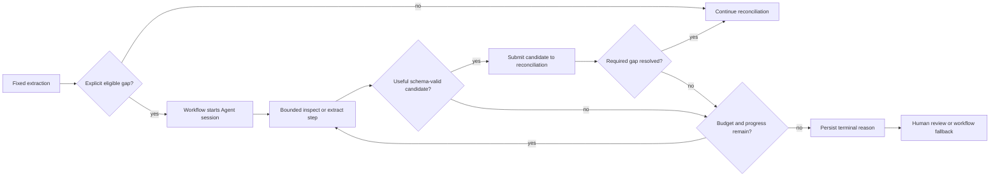
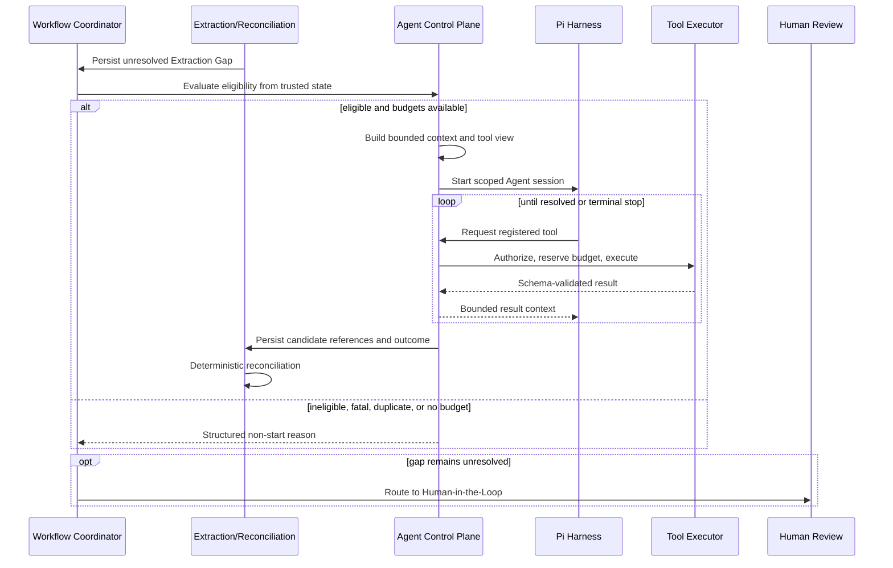
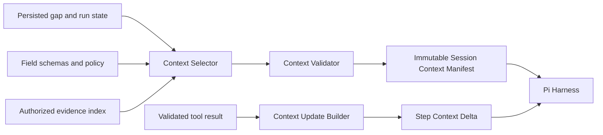
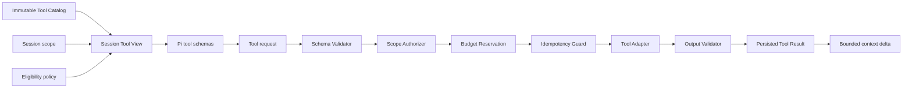

# Financial Document AI Agent Case Review Agent Specification

Document ID: `AGT`

Version: 2.1.0

Status: Approved

Last updated: 2026-09-04

## 1. Purpose

This specification defines the bounded Pi-based Case Review Agent that pre-screens every processable case, produces a Case Review Brief, and may recover explicit extraction gaps through an optional Adaptive Extraction mode.

The Agent acts like a junior document-review employee: it assembles evidence-grounded observations and suggests registered reviewer actions. It is not the workflow engine, a general coding agent, a validator, a disposition authority, or a banking decision-maker.

## 2. Authority and Dependencies

This document owns:

1. Per-case report scheduling, adaptive-recovery eligibility, context, lifecycle, stopping, and escalation.
2. Agent tool registration, authorization, validation, and execution semantics.
3. Execution budgets and no-progress controls.
4. Pi harness restrictions and isolation.
5. Agent-specific prompt-injection defenses, persistence, observability, and acceptance tests.

Normative dependencies are:

1. [`../INDEX.md`](../INDEX.md) for shared terminology.
2. [`../PRODUCT_AND_SCOPE.md`](../PRODUCT_AND_SCOPE.md) for the bounded-Agent product outcome.
3. [`../SYSTEM_ARCHITECTURE.md`](../SYSTEM_ARCHITECTURE.md) for workflow, model, trust, and deployable boundaries.
4. [`../DATA_MODEL.md`](../DATA_MODEL.md) for gaps, sessions, steps, invocations, candidates, evidence, and run provenance.
5. [`DOCUMENT_PROCESSING.md`](DOCUMENT_PROCESSING.md) for document inspection, rendering, native extraction, and OCR operations.

`AGT-REQ-001` The initial implementation must embed `pi-coding-agent` through its SDK behind a project-owned `CaseReviewAgentHarness` interface.

`AGT-REQ-002` Pi-specific session, message, tool, and provider types must not enter domain contracts.

`AGT-REQ-003` The Pi dependency and harness configuration must be pinned and recorded in the processing-run version manifest.

`AGT-REQ-004` Replacement of Pi must not change Agent authority, tool contracts, budgets, candidate validation, or durable workflow semantics without an approved specification change.

## 3. Placement in the Processing Flow



`AGT-REQ-005` The Workflow Coordinator, not the Agent, must decide whether and when an Agent session is scheduled.

`AGT-REQ-006` An Agent session must declare `adaptive_recovery` or `case_review_report` mode. Recovery requires one or more persisted eligible gaps; report mode requires one processable result revision after deterministic validation and disposition.

`AGT-REQ-007` Fixed native, OCR, local-table, and configured non-Agent extraction paths applicable to a gap must complete or explicitly fail before that gap becomes Agent-eligible.

`AGT-REQ-008` Agent eligibility must be determined by versioned workflow policy over structured gap properties, not by free-form model judgment.

`AGT-REQ-009` The Agent must not run for a gap that is already resolved, ineligible, assigned to a different run, or outside the configured document and field scope.

`AGT-REQ-010` Agent completion must return structured session outcome to the Workflow Coordinator; it must not transition workflow or case state directly.

### 3.1 Agent-in-the-Loop contract

The Case Review Agent is an Agent-in-the-Loop scheduled by the Workflow Coordinator. It may run an eligible Adaptive Extraction session during processing and must attempt a report session after deterministic disposition; it does not continuously observe cases or decide independently to join a workflow.



`AGT-REQ-104` Agent-in-the-Loop eligibility must require all of the following: a persisted unresolved gap; completed or explicitly failed applicable fixed extraction paths; current case and run scope; an enabled workflow-policy rule; at least one potentially relevant registered tool; available budgets; and no fatal intake or security failure.

`AGT-REQ-105` Eligibility evaluation must produce a persisted decision containing policy version, evaluated gap state, decision, and stable reason codes.

`AGT-REQ-106` The Agent must not trigger for a cross-document validation conflict, sufficient accepted candidate, unsupported or corrupt input, prohibited business action, unrelated-document need, completed equivalent recovery attempt without new inputs, or unavailable required budget.

`AGT-REQ-107` A newly created gap must not trigger the Agent merely because it exists; the Workflow Coordinator must observe committed prerequisite stages and evaluate the eligibility policy.

`AGT-REQ-108` A change to gap inputs, document revision, applicable tool version, or recovery policy may permit a new eligibility decision; elapsed time alone must not.

`AGT-REQ-109` A non-start decision must leave the gap explicit and return control to deterministic workflow routing.

## 4. Session Scope and Context

### 4.1 Context management architecture



The trusted Agent Control Plane owns context selection. Pi consumes the resulting view but cannot query arbitrary case state or mutate the context manifest.

`AGT-REQ-011` A session must bind exactly one case, one processing run, one stage attempt, one mode, one harness configuration version, one tool-registry version, and one budget envelope; it must additionally bind gaps in recovery mode or a result revision in report mode.

`AGT-REQ-012` All gaps in a recovery session must concern the same bounded logical document or explicitly approved contiguous page window.

`AGT-REQ-013` A session must receive only the minimum context required for its declared mode.

`AGT-REQ-014` Allowed context may include field schemas, gap descriptions, selected page metadata, bounded native or OCR text, existing candidate summaries, evidence metadata, and safe processing diagnostics.

`AGT-REQ-015` A session must not receive a complete case package, unrestricted application data, disposition-policy internals, credentials, or internal system configuration. Report mode may receive bounded persisted claim, evidence-index, gap, finding, and recommended-disposition projections for its bound result revision.

`AGT-REQ-016` Full document bytes and page images must be accessed only through scoped tools; they must not be embedded wholesale in the Agent instruction context.

`AGT-REQ-017` Existing candidates supplied as context must remain labeled as candidates and must include source and confidence semantics.

`AGT-REQ-018` Document text in context must be delimited and represented as untrusted data.

`AGT-REQ-019` Session construction must be deterministic for the same eligible gaps, committed inputs, configuration, and context-selection version, excluding trace and time metadata.

### 4.2 Context manifests and updates

`AGT-REQ-110` The Context Selector must resolve data through allowlisted repositories or application queries scoped by case, run, gap, logical document, page or region, and field schema.

`AGT-REQ-111` The initial session context must be represented by an immutable manifest containing included record and artifact references, versions, safe content hashes, scope, selection reasons, and context limits.

`AGT-REQ-112` Context limits must bound text length, image count and pixels, page count, candidate count, and prior-step summary size independently of the model token budget.

`AGT-REQ-113` Context selection must prefer referenced evidence regions and gap-relevant spans over whole-page content when the smaller context is sufficient.

`AGT-REQ-114` A context item must carry a provenance label and trust classification such as trusted control metadata, untrusted document content, untrusted model output, or validated tool result.

`AGT-REQ-115` Subsequent steps must receive an immutable context delta containing only validated new results and the references needed to relate them to the initial manifest.

`AGT-REQ-116` Context compaction or summarization must preserve gap identity, tool outcomes, evidence references, unresolved constraints, budget state, and trust labels.

`AGT-REQ-117` A model-generated summary must remain untrusted and must not replace authoritative tool results or persisted state.

`AGT-REQ-118` Context overflow must produce a structured selection failure or deterministic reduction; it must not silently drop required constraints, authority boundaries, or gap identity.

`AGT-REQ-119` Pi conversation history may be rebuilt from manifests and step records for diagnostics or recovery, but it must not become the sole source of context provenance.

## 5. Harness Capability Restrictions

`AGT-REQ-020` The Agent must be instantiated without Pi default coding tools.

`AGT-REQ-021` The Agent must have no Shell or process-execution tool.

`AGT-REQ-022` The Agent must have no arbitrary filesystem read or write capability.

`AGT-REQ-023` The Agent must have no generic HTTP, browser, URL-fetch, or unrestricted network tool.

`AGT-REQ-024` The Agent must not install packages, load runtime plugins, activate dynamic extensions, or discover tools or resources automatically.

`AGT-REQ-025` Unreviewed Pi packages, skills, extensions, prompt files, and tool definitions must not be loaded into a production-shaped session.

`AGT-REQ-026` The Agent must not receive database, object-store, model-provider, business-system, or telemetry credentials.

`AGT-REQ-027` Tool execution wrappers may hold scoped service capability, but the model must receive neither the credential nor an operation broader than the registered tool contract.

`AGT-REQ-028` No Agent tool may approve or reject a loan, calculate creditworthiness, open an account, disburse funds, contact a customer, or complete AML or KYC.

## 6. Tool Registry

The initial registered tool names are:

```text
inspect_page
get_native_text
run_ocr
render_page_region
classify_page
extract_with_vlm
get_extraction_gaps
submit_extraction_candidates
```

`AGT-REQ-029` The tool registry must be a finite, immutable, versioned set assembled by trusted application code before the session starts.

`AGT-REQ-030` Every tool must have a stable name, purpose, input schema, output schema, authorization policy, resource-cost classification, timeout, and implementation version.

`AGT-REQ-031` Tool input and output schemas must be allowlisted TypeBox or JSON Schema artifacts.

`AGT-REQ-032` A tool request must pass registry lookup, schema validation, session-scope authorization, resource-limit validation, and budget reservation outside the model before execution.

`AGT-REQ-033` An unknown, inactive, differently versioned, or malformed tool request must be rejected without best-effort interpretation.

`AGT-REQ-034` Tool names or arguments found in document content, OCR text, native text, model output data, or error messages must not be interpreted as authorized tool calls.

`AGT-REQ-035` The model must not create, modify, alias, compose, or activate a tool at runtime.

`AGT-REQ-036` Tool results must be validated before entering subsequent Agent context or candidate submission.

`AGT-REQ-037` A tool failure must return a structured, bounded, non-authoritative result and must not expose raw credentials, stack traces, or unrestricted file paths.

### 6.1 Tool management architecture



`AGT-REQ-120` The immutable Tool Catalog must be assembled at application startup from explicitly registered implementations and reviewed schema artifacts; it must not scan the filesystem, installed packages, prompts, or model output for tools.

`AGT-REQ-121` Each session must receive a Session Tool View containing only the subset permitted for its gap type, source scope, workflow policy, and remaining budgets.

`AGT-REQ-122` Removing a tool from a Session Tool View must not require changing the global catalog or expose the existence of unrelated tools to the model.

`AGT-REQ-123` Tool authorization and execution must occur in the ordered control chain shown in section 6.1; successful schema validation alone is not authorization.

`AGT-REQ-124` A tool-call idempotency key must derive from session, step, tool version, canonical validated arguments, authorized source versions, and relevant operation configuration.

`AGT-REQ-125` Tool results must be immutable and must distinguish success, retryable failure, non-retryable failure, budget rejection, authorization rejection, schema rejection, and duplicate resolution.

`AGT-REQ-126` A duplicate tool request must resolve to the committed compatible result when safe, or be rejected explicitly; it must not repeat an untracked side effect.

`AGT-REQ-127` Updating a tool implementation, input or output schema, authorization policy, or material configuration must create a new tool version.

`AGT-REQ-128` A session must retain the resolved tool versions it was offered, not only the current global catalog version.

## 7. Tool Semantics

`AGT-REQ-038` `inspect_page` must return bounded page structure and technical metadata for an authorized page without returning unrelated case content.

`AGT-REQ-039` `get_native_text` must return bounded native spans and evidence coordinates already committed for authorized pages or regions.

`AGT-REQ-040` `run_ocr` must invoke the approved OCR boundary for an authorized page or region and must retain OCR provenance and raw confidence semantics.

`AGT-REQ-041` `render_page_region` must require an authorized page and validated bounded region and must return an immutable derived-artifact reference.

`AGT-REQ-042` `classify_page` must invoke only the configured classifier operation and must return constrained classification candidates, not workflow commands.

`AGT-REQ-043` `extract_with_vlm` must invoke one configured task-specific Model Gateway operation over selected pages, a bounded consecutive-page window, or regions.

`AGT-REQ-044` `extract_with_vlm` must not expose tools to the extraction-model invocation.

`AGT-REQ-045` `get_extraction_gaps` must return only the session-bound gaps and their current persisted resolution state.

`AGT-REQ-046` `submit_extraction_candidates` must accept only candidates matching the session gaps, approved field schemas, source scope, and evidence requirements.

`AGT-REQ-047` Candidate submission must not write directly to authoritative Claim, Finding, Disposition, Rule, Prompt, or Workflow records.

`AGT-REQ-048` Submitted Agent candidates must enter the same structural validation, evidence validation, normalization, and reconciliation path as non-Agent candidates.

## 8. Model Gateway and Prompt Boundary

`AGT-REQ-049` The Agent must use only the model and provider route resolved for its configured operation; it must not select an arbitrary provider or model identifier.

`AGT-REQ-050` Each Agent and nested VLM invocation must resolve immutable model, prompt, input-schema, and output-schema versions before execution.

`AGT-REQ-051` A mutable prompt alias must not be the sole prompt identity stored in run provenance.

`AGT-REQ-052` Agent system instructions must define role, task, untrusted-data boundary, registered tools, output constraints, budgets, and prohibited actions.

`AGT-REQ-053` Document content must be placed only in a data-bearing channel or field and must not be concatenated into authority-bearing instructions.

`AGT-REQ-054` Model output must be treated as untrusted until envelope and operation-specific schema validation succeed.

`AGT-REQ-055` A schema-invalid response must not be repaired by executing instructions contained in that response.

`AGT-REQ-056` A model fallback may occur only according to configured Model Gateway policy and must preserve task and output-contract semantics.

## 9. Budgets

Every session budget envelope must contain finite limits for:

1. Agent iterations.
2. Total tool calls.
3. VLM calls.
4. Input and output tokens when reported or enforceable.
5. Wall-clock duration.
6. Estimated model cost.
7. Rendered pixels or equivalent image workload.
8. OCR pages or regions.

`AGT-REQ-057` Budget values must be positive, finite, configuration-controlled, and fixed for a started session.

`AGT-REQ-058` The trusted harness must reserve and check the applicable budget before starting a tool or model operation.

`AGT-REQ-059` A result that completes after its reserved budget or session deadline is exceeded may be retained for diagnostics but must not be accepted automatically as an authoritative candidate submission.

`AGT-REQ-060` Reported usage and estimated cost must be reconciled after each model operation without allowing the model to define its own budget consumption.

`AGT-REQ-061` Missing provider usage or pricing data must remain explicitly unavailable and must not be treated as zero cost.

`AGT-REQ-062` Exhausting any hard budget must prevent further affected operations and terminate or constrain the session according to configured policy.

`AGT-REQ-063` Budget changes must create a new configuration version and must not alter an active session.

## 10. Progress and Stopping

Agent session terminal reasons are:

```text
gaps_resolved
no_progress
conflicting_candidates
iteration_budget_exhausted
tool_budget_exhausted
model_budget_exhausted
token_budget_exhausted
cost_budget_exhausted
timeout
tool_failure
model_unavailable
schema_failure
cancelled_by_workflow
internal_error
```

`AGT-REQ-064` A session must terminate when all bound required gaps have accepted resolution candidates.

`AGT-REQ-065` A session must terminate when a hard budget is exhausted, the deadline passes, workflow cancellation is observed, or no permitted next action remains.

`AGT-REQ-066` Progress must be measured from trusted persisted state, including new valid evidence, a new schema-valid candidate, or a resolved gap; model narrative alone is not progress.

`AGT-REQ-067` Repeating an equivalent tool call over the same material inputs without new valid output must increment a no-progress counter.

`AGT-REQ-068` The session must stop with `no_progress` when the configured consecutive no-progress limit is reached.

`AGT-REQ-069` Conflicting candidates that cannot be reconciled within configured policy must remain preserved and terminate with `conflicting_candidates` or escalate without choosing by model preference alone.

`AGT-REQ-070` Exactly one terminal reason must be recorded for a terminal Agent session.

`AGT-REQ-071` A non-success terminal reason must preserve unresolved gaps for deterministic workflow routing to retry, fallback, or human review.

## 11. Persistence and Recovery

`AGT-REQ-072` PostgreSQL stage, gap, session, step, invocation, candidate, and budget records must be the durable record of Agent work.

`AGT-REQ-073` Pi conversation memory and in-process session state must not be authoritative workflow state.

`AGT-REQ-074` Each completed Agent step must persist tool identity, validated argument hash or safe arguments, outcome, usage, budget state, trace identity, and produced record references.

`AGT-REQ-075` Persisted Agent records must not contain complete documents, page images, unrestricted extracted text, credentials, or unrestricted prompts and responses.

`AGT-REQ-076` Loss of the Agent process must not lose previously committed candidates, artifacts, gap state, budget consumption, or workflow ownership.

`AGT-REQ-077` Recovery may start a new Agent session or resume through an explicitly supported harness mechanism, but it must first reconstruct authority and remaining budgets from trusted persisted state.

`AGT-REQ-078` Recovery must not replay a completed non-idempotent tool operation solely because conversational context was lost.

`AGT-REQ-079` Duplicate delivery of the same Agent stage job must not create two active authoritative sessions for the same session identity.

## 12. Retry and Recovery Matrix

Retries operate at different layers. A lower layer must not conceal repeated work from the durable layer that owns its budget and attempt history.

| Layer | Typical trigger | Owner | Same identity? | Budget effect | Maximum outcome |
|---|---|---|---|---|---|
| Adapter transport retry | Connection reset before a confirmed response | Tool or Model Gateway adapter | Same tool/model invocation | Counts according to configured attempt policy | One invocation result |
| Tool-call retry | Retryable structured tool failure | Agent Control Plane | Same logical tool call; new execution attempt | Reserves additional operation budget | Validated tool result or terminal tool failure |
| Model-call retry | Retryable provider failure or declared schema-repair attempt | Model Gateway policy | Same task identity; new invocation attempt | Counts tokens, calls, time, and cost | Schema-valid response or terminal model failure |
| Agent-step continuation | Valid result leaves gap unresolved | Pi harness under control plane | New step identity | Counts iteration and relevant tool budgets | New candidate, progress, or stop |
| Session retry | Process loss or retryable session infrastructure failure | Workflow Coordinator | New session attempt linked to prior session | Uses persisted remaining or newly authorized budget | Terminal session outcome |
| Stage retry | Agent stage fails or is redelivered | Workflow Coordinator and pg-boss | New stage attempt in same run | New configured stage budget envelope | Committed session outcome |
| New run | Inputs or material versions change | Workflow Coordinator | New processing-run identity | Fresh explicitly configured budgets | New immutable machine result |

`AGT-REQ-129` Only failures classified by trusted adapter or control-plane policy as retryable may be retried automatically.

`AGT-REQ-130` Retry classification must use stable reason codes and operation state, not free-form exception text or a model request to retry.

`AGT-REQ-131` A retry policy must define maximum attempts, backoff class, retryable categories, timeout, idempotency behavior, and budget accounting.

`AGT-REQ-132` Backoff waiting must not occupy a worker process when durable workflow scheduling can represent the delay.

`AGT-REQ-133` A transport retry must be prohibited when the adapter cannot determine whether a non-idempotent operation completed and no idempotency mechanism exists.

`AGT-REQ-134` A schema-repair model attempt must use an approved bounded repair prompt, count as a model call, and must not introduce document instructions into an authority-bearing channel.

`AGT-REQ-135` Repeating OCR, rendering, classification, or VLM extraction with unchanged inputs and versions must reuse compatible committed output when the operation contract declares it cacheable and integrity checks pass.

`AGT-REQ-136` A session retry must reconstruct remaining budgets from persisted reservations and reconciled usage; it must not reset consumed budgets automatically.

`AGT-REQ-137` A stage retry may authorize a new session budget only through versioned workflow policy and must retain the prior session and budget history.

`AGT-REQ-138` A material input, prompt, model route, tool implementation, schema, or recovery-policy change must not be hidden as a retry when reproducibility requires a new processing run.

`AGT-REQ-139` Retry exhaustion must yield one structured terminal outcome and return control to workflow fallback or human review without an internal infinite retry cycle.

## 13. Instruction-Injection Resistance

`AGT-REQ-080` Text or imagery instructing the Agent to ignore policy, reveal secrets, call tools, change rules, select a disposition, or perform a banking action must remain inert document data.

`AGT-REQ-081` Tool authorization must depend on trusted session scope and registry state, never on a model explanation of why an operation is allowed.

`AGT-REQ-082` A document cannot expand page, region, logical-document, case, run, field-schema, model, or tool scope.

`AGT-REQ-083` A tool result containing instruction-like text must retain the same untrusted-data treatment as source document text.

`AGT-REQ-084` The Agent must not reveal system instructions, prompt artifacts, registry internals, credentials, or unrelated processing data in a candidate or tool argument.

`AGT-REQ-085` Rejected policy-violating requests must be recorded using safe reason codes without persisting the sensitive requested content unnecessarily.

## 14. Case Review Brief

`AGT-REQ-144` The Workflow Coordinator must attempt exactly one current `case_review_report` session for every processable result revision before presenting that revision for human review.

`AGT-REQ-145` Report mode must receive a deterministic `CaseReviewContext` containing document inventory, material claim references, evidence availability, extraction gaps, deterministic findings, recommended disposition, and safe processing diagnostics for one result revision.

`AGT-REQ-146` Report mode must be read-only except for `submit_case_review_brief`; it must not submit extraction candidates, mutate claims, evaluate rules, change findings or disposition, or transition workflow state.

`AGT-REQ-147` A `CaseReviewBrief` must contain schema version, bound result revision, report status, concise case summary, zero or more registered review signals, zero or more registered suggested actions, ordered reviewer-attention items, and supporting record references.

The initial review-signal vocabulary is `document_missing`, `document_type_uncertain`, `document_boundary_uncertain`, `field_missing`, `field_low_confidence`, `evidence_missing`, `evidence_ambiguous`, `conflicting_candidates`, `validation_finding_requires_attention`, `instruction_like_content_observed`, `processing_failure`, `agent_budget_exhausted`, and `agent_report_unavailable`.

The initial suggested-action vocabulary is `inspect_evidence`, `compare_claims`, `verify_extracted_value`, `review_document_boundary`, `review_missing_document`, `review_conflicting_candidates`, `review_agent_recovery`, `rerun_bounded_extraction`, `edit_issue`, `request_changes`, and `escalate_review`. The Agent must not suggest `accept_signal`, `dismiss_signal`, or `clear_for_downstream` for its own output.

`AGT-REQ-148` Every review signal and suggested action must cite at least one current persisted claim, evidence item, gap, finding, processing failure, or Agent-session outcome; free-standing speculation is invalid.

`AGT-REQ-149` The Agent may order reviewer-attention items within its brief but must not change deterministic finding severity, rule outcome, disposition precedence, or workflow priority.

`AGT-REQ-150` A deterministic Report Verifier must reject a brief whose schema is invalid, references are absent or outside the bound result revision, vocabulary is unregistered, displayed values conflict with referenced records, or content expresses a prohibited lending, creditworthiness, AML, KYC, account, pricing, disbursement, or customer-contact decision.

`AGT-REQ-151` Only a verified brief may be displayed as the current Agent report. Original submitted output and rejection reasons must remain immutable safe diagnostic provenance.

`AGT-REQ-152` Report failure, timeout, budget exhaustion, or verification rejection must produce an explicit unavailable status and route the deterministic case result to human review without fabricating a brief or blocking access to claims, evidence, findings, and disposition.

`AGT-REQ-153` A human reviewer must confirm or supersede the document-processing result through registered review actions; an Agent suggestion never constitutes that action.

`AGT-REQ-154` Default continuous integration must cover verified, schema-rejected, reference-rejected, policy-rejected, timeout, and unavailable report fixtures with a fake Agent adapter.

## 15. Observability

`AGT-REQ-086` Agent telemetry must correlate case, run, gap, session, step, stage attempt, model invocation, tool call, and trace identifiers as applicable.

`AGT-REQ-087` Metrics must include session outcomes, terminal reasons, iterations, tool calls by name and outcome, VLM calls, token usage when available, estimated cost when available, duration, schema failures, no-progress stops, and candidate acceptance outcome.

`AGT-REQ-088` The Review Workbench must be able to query a safe ordered recovery trace containing actions, outcomes, candidate references, evidence references, usage, latency, and estimated cost availability.

`AGT-REQ-089` Logs and traces must not contain unrestricted model context, chain-of-thought, complete documents, page images, full identity numbers, full IBANs, or credentials.

`AGT-REQ-090` The system must report measured Agent behavior without claiming unsupported autonomy, accuracy, cost, latency, or production safety.

## 16. Acceptance Criteria

The Agent component is acceptable for implementation when automated tests demonstrate that:

`AGT-REQ-091` An eligible golden-case gap starts one scoped Agent session after applicable fixed extraction paths complete.

`AGT-REQ-092` A schema-valid, evidence-linked Agent candidate enters ordinary reconciliation and can resolve its bound gap without becoming a finding directly.

`AGT-REQ-093` An unresolved or exhausted session leaves the gap visible and routes control back to durable workflow for human review or configured fallback.

`AGT-REQ-094` Every registered tool rejects cross-case, cross-run, cross-document, cross-page, cross-region, and unsupported-field access.

`AGT-REQ-095` Unknown tools, malformed arguments, runtime extensions, Shell requests, arbitrary file requests, and unrestricted network requests cannot execute.

`AGT-REQ-096` Extraction-model calls made by `extract_with_vlm` expose no tools and reject schema-invalid output.

`AGT-REQ-097` Iteration, tool-call, VLM-call, token, timeout, cost, pixel, and OCR budgets stop further affected work at their configured limits.

`AGT-REQ-098` Repeated equivalent actions terminate through the no-progress policy rather than loop indefinitely.

`AGT-REQ-099` Worker termination after a committed step permits recovery from PostgreSQL and pg-boss state without relying on Pi conversation memory.

`AGT-REQ-100` Duplicate stage-job delivery does not create duplicate authoritative sessions, candidates, or tool side effects.

`AGT-REQ-101` Prompt-injection fixtures cannot modify tools, schemas, prompts, budgets, rules, dispositions, workflow state, or banking capabilities.

`AGT-REQ-102` Fake harness, fake model, and fake tool adapters support deterministic default continuous-integration tests without paid or external model calls.

`AGT-REQ-103` The adaptive demo path exposes recovery actions, resulting candidates and evidence, terminal outcome, latency, model usage, and estimated cost availability.

`AGT-REQ-155` Every primary demo path attempts report generation, exposes verification status and supporting references, and proceeds to human review even when the report is unavailable.

`AGT-REQ-156` A Case Review Brief may attach one applicant-readable requested-change draft to a review signal when the registered suggested action is `request_changes`; the draft must use plain language, remain evidence-grounded, and must not contain internal processing detail or imply customer-contact authority or a banking decision.

`AGT-REQ-157` The Report Verifier must validate requested-change draft structure, signal binding, references, and prohibited content. A verified draft remains non-authoritative and cannot be included in a final review message without an explicit human action.

`AGT-REQ-140` Eligibility tests prove that eligible extraction gaps trigger Agent-in-the-Loop only after fixed paths finish, while validation conflicts, fatal inputs, duplicate attempts, and insufficient budgets do not.

`AGT-REQ-141` Context tests prove that manifests are scoped, size-bounded, trust-labeled, reproducible, and preserve required control metadata during compaction.

`AGT-REQ-142` Tool-management tests prove the catalog is static, each session receives only an eligible subset, and every request traverses schema, authorization, budget, idempotency, execution, and output-validation controls.

`AGT-REQ-143` Retry tests distinguish transport, tool, model, step, session, stage, and new-run behavior and prove that usage and attempts are not reset or hidden across layers.

## 17. Assumptions and Deferred Evidence

1. Only synthetic or explicitly demo-safe documents enter the initial demonstration.
2. Exact budget values, no-progress limits, default model, fallback model, and eligibility thresholds require golden-set evidence and remain in [`../../BACKLOG.md`](../../BACKLOG.md).
3. Pi SDK integration details and hardening configuration require an implementation proof and `ADR_001_PI_AGENT_HARNESS.md` before the Agent vertical slice is considered complete.
4. Detailed field schemas and reconciliation behavior belong to the extraction and validation specifications or executable contract artifacts.
5. The initial Agent is single-purpose and does not provide a general user-facing chat interface.

No unresolved Agent-authority decision blocks review of this document.

## 18. Document History

| Version | Date | Status | Change |
|---|---|---|---|
| 2.1.0 | 2026-09-04 | Approved | Added optional verified applicant-readable requested-change drafts without delivery or decision authority for the V1 review workflow. |
| 2.0.0 | 2026-09-04 | Approved | Expanded Pi into a per-case pre-screening Agent with a verified Case Review Brief while retaining optional bounded adaptive extraction. |
| 1.0 | 2026-09-03 | Approved | Approved the bounded Pi harness, Agent-in-the-Loop trigger, context, tool, retry, budget, stopping, persistence, and safety baseline. |
