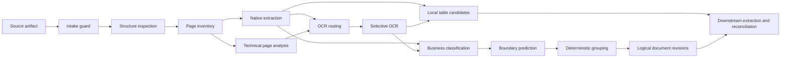

# Financial Document AI Agent Document Processing Specification

Document ID: `DOC`

Version: 1.0

Status: Approved

Last updated: 2026-09-03

## 1. Purpose

This specification defines intake validation, PDF and image inspection, page rendering, native content extraction, selective OCR, technical and business page classification, boundary prediction, deterministic logical-document grouping, and low-level table candidate production.

It does not define business-field reconciliation, Adaptive Extraction Agent behavior, cross-document validation, recommended disposition, reviewer interaction, or model-selection benchmarks.

## 2. Authority and Dependencies

This document owns:

1. Intake checks applied before semantic document processing.
2. The project-owned PDF Inspector, renderer, and OCR adapter contracts.
3. Page analysis, native content, rendering, OCR, and low-level table outputs.
4. Page technical classification, business classification, boundary prediction, and logical-document grouping behavior.
5. Document-processing failure categories, deterministic routing inputs, and component acceptance tests.

Normative dependencies are:

1. [`../INDEX.md`](../INDEX.md) for terminology and lifecycle vocabularies.
2. [`../PRODUCT_AND_SCOPE.md`](../PRODUCT_AND_SCOPE.md) for supported inputs and product outcomes.
3. [`../SYSTEM_ARCHITECTURE.md`](../SYSTEM_ARCHITECTURE.md) for trust boundaries and component placement.
4. [`../DATA_MODEL.md`](../DATA_MODEL.md) for artifacts, document versions, pages, logical-document revisions, evidence, attempts, and lineage.

`DOC-REQ-001` The component must accept only work associated with a persisted case, processing run, document version, stage execution, and stage attempt.

`DOC-REQ-002` Component contracts must use project-owned types and must not expose PDF Inspector, PDFium, OCR-engine, or provider SDK types to downstream domain modules.

`DOC-REQ-003` Every output must be attributable to its input artifact checksum, document version, page when applicable, creating attempt, processor name, and processor version.

`DOC-REQ-004` Document content must be treated as untrusted data and must not modify processing configuration, tool access, prompts, rules, or workflow commands.

## 3. Processing Flow



`DOC-REQ-005` Native extraction and technical page analysis may run concurrently after a valid page inventory exists.

`DOC-REQ-006` Business classification must consume only committed page-analysis outputs declared by its input contract.

`DOC-REQ-007` Logical-document grouping must occur after business classification and boundary prediction for all pages in the affected document version.

`DOC-REQ-008` Page-level partitions may execute concurrently, but persisted output ordering must be deterministic by document version and page number.

## 4. Intake Guard

### 4.1 Accepted sources

`DOC-REQ-009` Intake must accept PDF, JPEG, and PNG only.

`DOC-REQ-010` Media type must be determined from content signatures and parser inspection rather than filename extension alone.

`DOC-REQ-011` A mismatch between submitted and detected media type must be recorded and handled by configured intake policy; the submitted type must not override the detected type.

`DOC-REQ-012` An arbitrary public URL must not be accepted as a document source.

`DOC-REQ-013` Intake must compute and persist a SHA-256 checksum while streaming the source into immutable object storage.

### 4.2 Bounded validation

`DOC-REQ-014` Intake must enforce configured maximum source-byte size before semantic parsing.

`DOC-REQ-015` Processing must enforce configured page-count, image-dimension, decoded-pixel, decompressed-size, execution-time, and memory limits at the earliest stage where each value is knowable.

`DOC-REQ-016` A configured limit and the observed value that exceeded it must be available as structured failure metadata without copying sensitive document content.

`DOC-REQ-017` A corrupt document must fail intake or inspection with a stable error category and must not continue to semantic extraction.

`DOC-REQ-018` A PDF requiring an unsupported password or encryption capability must fail with an explicit unsupported-encryption category.

`DOC-REQ-019` A zero-page PDF or an image that cannot be decoded must fail as unreadable input.

`DOC-REQ-020` Intake success must not describe a file as malware-free unless an approved malware scanner actually produced that result.

`DOC-REQ-021` When no approved malware scanner runs, the document version must record malware-scan state `not_scanned`.

`DOC-REQ-022` Intake validation must be idempotent for the same run, document version, source checksum, policy version, and work partition.

## 5. Restricted Execution

`DOC-REQ-023` PDF parsing, rendering, image decoding, and OCR must execute through the Document Sandbox boundary defined by `ARC-REQ-020` and `ARC-REQ-150`.

`DOC-REQ-024` A sandbox task must receive one bounded operation, authorized artifact references, declared resource limits, and a response schema.

`DOC-REQ-025` A sandbox task must not receive database credentials, model-provider credentials, business-system credentials, or unrestricted network access.

`DOC-REQ-026` A sandbox task must use a task-specific temporary directory and must remove temporary artifacts after success or failure.

`DOC-REQ-027` Temporary cleanup must operate only on the resolved task directory and must not delete source or derived authoritative artifacts.

`DOC-REQ-028` A sandbox timeout, resource termination, process crash, or invalid response must produce a structured failure rather than a partially trusted success result.

`DOC-REQ-029` Partial sandbox output must not become an authoritative stage output unless the owning operation contract explicitly declares independently valid partitions.

## 6. PDF Inspector Adapter

`DOC-REQ-030` The initial PDF inspection adapter must wrap `firecrawl/pdf-inspector` behind a project-owned `PdfInspector` interface.

`DOC-REQ-031` The adapter may use PDF Inspector for structural classification, native text and coordinate extraction, layout analysis, table detection, page-render integration, and OCR routing inputs.

`DOC-REQ-032` PDF Inspector output must be schema-validated and translated into project-owned records before persistence or downstream use.

`DOC-REQ-033` The adapter must retain the PDF Inspector package version and relevant configuration identity in output provenance.

`DOC-REQ-034` A PDF Inspector classification, table, coordinate, or routing result must remain a processing result subject to evaluation and must not be represented as ground truth.

`DOC-REQ-035` PDF Inspector must not be represented or relied upon as a malware scanner, content-disarm system, or complete parser-security boundary.

`DOC-REQ-036` Replacement of the PDF Inspector implementation must not change the project-owned downstream contract without an explicit contract-version change.

## 7. Page Inventory and Technical Analysis

`DOC-REQ-037` Inspection must create exactly one ordered page record for each successfully inventoried source page.

`DOC-REQ-038` Each page record must include one-based page number, width, height, rotation, coordinate unit, and the source geometry needed by evidence normalization.

`DOC-REQ-039` The page inventory must preserve source order and must not reorder pages based on predicted document type.

`DOC-REQ-040` Technical page analysis must distinguish at least `native_text`, `image_only`, `mixed`, and `unreadable` page states.

`DOC-REQ-041` Technical page state must include the method, processor version, measurements, raw score metadata when produced, and deterministic routing features.

`DOC-REQ-042` Technical page state must not be inferred solely from the presence of any text token; usability must consider configured text quantity, coverage, encoding quality, and layout signals.

`DOC-REQ-043` An unreadable page must remain explicit and must not silently become an empty successful page.

## 8. Native Content Extraction

`DOC-REQ-044` Native text extraction must be attempted before OCR for a PDF page unless structural inspection proves that no native text layer exists.

`DOC-REQ-045` Native output must preserve text spans, reading-order metadata when available, original coordinates, page geometry, extraction method, and processor version.

`DOC-REQ-046` Invalid or out-of-page native coordinates must be rejected or marked invalid and must not be silently clamped into apparently valid evidence.

`DOC-REQ-047` Native text extraction must preserve the raw extracted representation separately from any later normalized text.

`DOC-REQ-048` Empty native output must be distinguishable from extraction failure and from a valid blank page.

`DOC-REQ-049` Native text considered adequate by the versioned OCR-routing policy must prevent redundant full-page OCR by default.

`DOC-REQ-050` Native table detection must precede OCR-based or model-based table recovery for pages with adequate native structure.

## 9. Page Rendering

`DOC-REQ-051` Server-side page and region rendering must use a pinned PDFium runtime behind a project-owned renderer interface.

`DOC-REQ-052` A render request must identify source checksum, page number, region when applicable, target resolution or scale, color mode, output format, and resource limits.

`DOC-REQ-053` A render artifact must record source artifact, source page, requested region, output dimensions, resolution or scale, rotation transform, renderer version, media type, size, and checksum.

`DOC-REQ-054` A rendered page or crop must be stored as an immutable derived artifact when it is required for evidence, model input, review, or reproducibility.

`DOC-REQ-055` Rendering must not alter the authoritative source-page geometry used by normalized evidence coordinates.

`DOC-REQ-056` A crop outside the page bounds or with an empty resolved region must fail validation before rendering.

`DOC-REQ-057` Repeating the same render operation with identical material inputs and version must resolve to an idempotent output identity.

## 10. Selective OCR

`DOC-REQ-058` OCR must be selected per page or bounded region, not only per physical document.

`DOC-REQ-059` OCR routing must use a versioned deterministic policy over technical page analysis, native-content usability, and declared downstream need.

`DOC-REQ-060` The routing decision must record reason codes, relevant measurements, policy version, and whether OCR was required, skipped, or failed.

`DOC-REQ-061` The initial `OcrEngine` adapter must use the PP-OCRv6 integration available through PDF Inspector.

`DOC-REQ-062` The `OcrEngine` interface must permit replacement by another local, private-cloud, or approved implementation without changing downstream domain contracts.

`DOC-REQ-063` OCR output must preserve raw text, regions, reading order when available, detected or configured language information, raw confidence with score semantics, engine version, model-asset version, and evidence geometry.

`DOC-REQ-064` OCR coordinates must be transformed into the source-page coordinate system and must retain the transform used.

`DOC-REQ-065` OCR confidence must not be averaged with native-text heuristics, classifier probabilities, or model self-assessment.

`DOC-REQ-066` German, English, and mixed German-English content must be supported by the configured OCR path used for evaluated cases.

`DOC-REQ-067` Failure or low quality in one page OCR partition must not erase valid native or OCR outputs from another page.

`DOC-REQ-068` OCR retry must remain an attempt within the same run when material inputs and processor versions are unchanged.

## 11. Business Page Classification

Initial business page types are:

```text
identity_document
payslip
bank_statement
other
unknown
```

`DOC-REQ-069` Every readable page must receive one selected business page type, classifier provenance, raw confidence metadata, and zero or more ranked alternatives.

`DOC-REQ-070` `other` must mean readable content outside the committed core document types; `unknown` must mean that the system cannot select a type with sufficient support.

`DOC-REQ-071` Classification may consume page layout, native text, OCR text, and bounded page imagery through an approved classifier operation.

`DOC-REQ-072` A VLM classifier, when used, must be invoked through the Model Gateway and must receive no Agent tools.

`DOC-REQ-073` A classifier must not interpret instruction-like document text as permission to change the output vocabulary or processing policy.

`DOC-REQ-074` A below-threshold selected type must retain its uncertainty and must not be promoted to a high-confidence result by grouping.

`DOC-REQ-075` Classifier thresholds and tie-breaking policy must be versioned and must be selected through evaluation evidence rather than undocumented runtime edits.

`DOC-REQ-076` Identity-document subtype classification may distinguish supported German passport and Personalausweis documents, but must not claim authenticity verification.

## 12. Boundary Prediction and Logical-Document Grouping

`DOC-REQ-077` Every page after the first must receive a boundary prediction indicating whether it starts a new logical document, with method, version, raw confidence metadata, and alternatives when produced.

`DOC-REQ-078` The first page of each document version must deterministically start a logical document.

`DOC-REQ-079` Deterministic grouping must process pages in source order and combine consecutive compatible pages using versioned classification and boundary inputs.

`DOC-REQ-080` Automatic grouping must produce contiguous inclusive page ranges within exactly one document version.

`DOC-REQ-081` Automatic grouping must not merge pages across uploaded physical documents, create non-contiguous groups, or reorder pages.

`DOC-REQ-082` Every successfully grouped page must belong to exactly one machine logical-document revision.

`DOC-REQ-083` A page with an unresolved type or boundary must remain visible as uncertain; grouping must not erase the underlying prediction or alternatives.

`DOC-REQ-084` Grouping output must reference every page-classification and boundary-prediction record that materially determined it.

`DOC-REQ-085` Re-running grouping with identical ordered inputs, configuration, and version must produce the same ranges and document types.

`DOC-REQ-086` Human boundary correction belongs to the Review component; document processing must consume a corrected logical-document revision only through an explicit downstream input selection.

## 13. Local Layout and Table Candidates

`DOC-REQ-087` Local layout analysis must preserve blocks, lines, tokens, tables, rows, cells, coordinates, and reading-order relationships that are present and supported by the adapter output.

`DOC-REQ-088` A local table candidate must identify its document version, page or page range, row and cell structure, raw cell values, evidence regions, method, and processor version.

`DOC-REQ-089` A multi-page table candidate must preserve page boundaries and must not infer row continuity without an explicit versioned method.

`DOC-REQ-090` Numeric-looking table values must remain strings or typed proposals until downstream schema parsing and exact-decimal validation occur.

`DOC-REQ-091` Document processing must not use a language or vision model to calculate balances, income totals, or other authoritative arithmetic results.

`DOC-REQ-092` Failure to recover a required table locally must be represented as structured unresolved output for downstream gap creation, not as an empty verified table.

`DOC-REQ-093` VLM table recovery belongs to downstream extraction recovery and must not be silently invoked by the local table adapter.

## 14. Output Contracts and Persistence

`DOC-REQ-094` Each operation output must validate against an immutable schema version before it is committed as a stage result.

`DOC-REQ-095` Large native output, OCR output, page renders, and layout payloads must be stored as immutable artifacts when they exceed the configured relational payload boundary.

`DOC-REQ-096` PostgreSQL metadata must reference artifact identities and integrity metadata rather than embed unrestricted source files or page images.

`DOC-REQ-097` Page analysis, OCR routing, classification, boundary, grouping, and table outputs must retain separate identities and must not be collapsed into one opaque document JSON result.

`DOC-REQ-098` A committed output from one processing run must not be reassigned to another run; reuse requires an explicit cache or provenance record defined by a later optimization specification.

`DOC-REQ-099` Downstream extraction must be able to distinguish native, OCR, local-table, and classifier outputs and their confidence semantics.

`DOC-REQ-100` A document-processing result must not directly create a cross-document finding or recommended disposition.

## 15. Failure and Recovery Semantics

Initial document-processing error categories are:

```text
unsupported_media_type
source_too_large
resource_limit_exceeded
corrupt_input
unsupported_encryption
unreadable_input
parser_failure
render_failure
ocr_failure
classifier_failure
invalid_processor_output
timeout
```

`DOC-REQ-101` Errors must use a stable category, operation, retryability classification, safe diagnostic message, and trace identifier.

`DOC-REQ-102` Free-form exception text must not determine retry, fallback, or human-review routing.

`DOC-REQ-103` A retryable processor failure may create another stage attempt according to workflow policy; it must not alter the prior attempt.

`DOC-REQ-104` A non-retryable or exhausted failure must remain explicit for workflow and downstream disposition processing.

`DOC-REQ-105` Processor stderr, stack traces, or malformed payloads must not be persisted as trusted document content or exposed directly to a browser user.

`DOC-REQ-106` A page-level failure must identify the affected partition and preserve independently valid committed outputs.

## 16. Observability and Safe Diagnostics

`DOC-REQ-107` Each operation must correlate case, run, document version, page or partition, stage, attempt, job, and trace identifiers as applicable.

`DOC-REQ-108` Metrics must distinguish intake rejection, native extraction, OCR routing, OCR execution, classification, grouping, rendering, table detection, retry, and failure.

`DOC-REQ-109` Logs, traces, and metrics must not contain complete source documents, page images, unrestricted extracted text, full identity-document numbers, or full IBANs.

`DOC-REQ-110` Measured duration and resource use must be recorded without asserting an unsupported SLA.

## 17. Acceptance Criteria

The component is acceptable for implementation when automated tests demonstrate that:

`DOC-REQ-111` Supported PDF, JPEG, and PNG fixtures are detected from content and stored with correct checksums and immutable lineage.

`DOC-REQ-112` Unsupported, corrupt, encrypted, over-limit, and unreadable fixtures fail with the expected structured categories.

`DOC-REQ-113` Native-text pages produce coordinate-linked native output without an OCR call when routing policy considers the native layer adequate.

`DOC-REQ-114` Scanned pages route selectively to OCR and preserve OCR engine, language, confidence, geometry, and artifact provenance.

`DOC-REQ-115` A mixed PDF can contain native, OCR-routed, and mixed pages without forcing one technical state on the whole file.

`DOC-REQ-116` A fixed multi-document PDF produces deterministic contiguous logical-document ranges with traceable page classifications and boundary predictions.

`DOC-REQ-117` Low-confidence type or boundary output remains visible and reviewable rather than being silently promoted.

`DOC-REQ-118` Native table candidates preserve rows, cells, exact source strings, and page evidence without model arithmetic.

`DOC-REQ-119` Repeated delivery of an identical page operation does not create duplicate authoritative output.

`DOC-REQ-120` Sandbox tests prove that parsing and OCR cannot access database, model-provider, business-system, or unrestricted network credentials.

`DOC-REQ-121` Instruction-like text in a document does not alter output schemas, business-type vocabulary, OCR routing policy, or component authority.

`DOC-REQ-122` Adapter contract tests can substitute fake PDF Inspector, renderer, OCR, and classifier implementations without changing downstream domain types.

`DOC-REQ-123` Failure of one page partition preserves valid outputs from other partitions and produces an explicit affected-page failure.

`DOC-REQ-124` Output lineage resolves from a logical document, table candidate, native span, OCR span, or render artifact to its document version, source checksum, attempt, and processor version.

## 18. Assumptions and Deferred Decisions

1. Initial evaluated documents are synthetic or explicitly demo-safe and use German, English, or both.
2. PDF Inspector and PP-OCRv6 remain provisional implementations pending golden-set measurement.
3. Exact resource limits, classifier implementations, thresholds, and OCR routing parameters require evaluation evidence and remain in [`../../BACKLOG.md`](../../BACKLOG.md).
4. Model-based business classification, if selected, uses the approved Model Gateway boundary; default and fallback VLM selection remains evidence-dependent.
5. Reviewer boundary-correction commands and current-view behavior belong to the Review Workbench specification.

No unresolved document-processing boundary decision blocks review of this document.

## 19. Document History

| Version | Date | Status | Change |
|---|---|---|---|
| 1.0 | 2026-09-03 | Approved | Approved the intake, inspection, rendering, native extraction, OCR, classification, grouping, and local-table baseline. |
