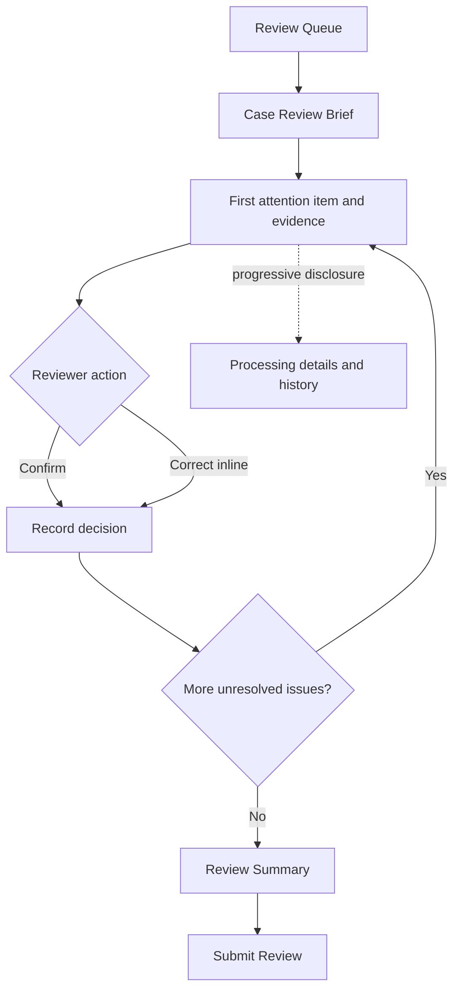

# Financial Document AI Agent Review Workbench Specification

Document ID: `UI`

Version: 3.7.0

Status: Approved

Last updated: 2026-09-08

## 1. Purpose

This specification defines the V1 Review Queue, Pi Case Review Brief, compact processing progress, document and structured-application inspection, issue review, requested-change drafts, final document-review actions, and bounded case Agent log. Aggregate Agent monitoring is deferred.

The workbench supports document-processing review only. It is not a lending, account-opening, disbursement, customer-contact, AML, or KYC decision interface.

## 2. Authority and Dependencies

This document owns:

1. Review Workbench information architecture and reviewer workflows.
2. Evidence-viewer and correction interaction behavior.
3. Review-action vocabulary and presentation safeguards.
4. Agent brief and safe case Agent log presentation.

Normative dependencies are:

1. [`../INDEX.md`](../INDEX.md) for controlled system vocabularies.
2. [`../PRODUCT_AND_SCOPE.md`](../PRODUCT_AND_SCOPE.md) for reviewer goals and prohibited actions.
3. [`../SYSTEM_ARCHITECTURE.md`](../SYSTEM_ARCHITECTURE.md) for browser, API, storage, and trust boundaries.
4. [`../DATA_MODEL.md`](../DATA_MODEL.md) for revisions, corrections, evidence, reviews, and audit events.
5. [`ADAPTIVE_EXTRACTION_AGENT.md`](ADAPTIVE_EXTRACTION_AGENT.md) for Agent Report, requested-change draft, and safe activity semantics.
6. [`VALIDATION_AND_DISPOSITION.md`](VALIDATION_AND_DISPOSITION.md) for findings and recommended-disposition semantics.

`UI-REQ-001` The Review Workbench must be a browser application implemented with the approved React, Vite, TanStack Query, React Router, PDF.js, Radix UI Primitives, CSS Modules, Lucide React, Motion, and native system font-stack baseline.

`UI-REQ-002` The browser must access application state and commands only through versioned API contracts and must not connect directly to PostgreSQL, object storage, pg-boss, model providers, or worker processes.

`UI-REQ-003` Browser state must not be authoritative for a case, run, result revision, claim, correction, finding, disposition, review record, or audit event.

`UI-REQ-004` Display labels must not redefine controlled status, finding, or disposition semantics.

## 3. Information Architecture



`UI-REQ-005` V1 must provide a case list and a stable route to case detail.

`UI-REQ-006` Deprecated in V3.0; the V1 case entry is governed by `UI-REQ-157`.

`UI-REQ-007` A reviewer must be able to navigate from a finding to each material claim and from a claim to its page or structured-input evidence.

`UI-REQ-008` The default review path must suppress nonessential technical metadata, while a reviewer must still be able to distinguish the active processing run and current result revision from historical runs and superseded revisions in processing details.

`UI-REQ-009` Historical machine results and human review revisions must remain inspectable and must not be visually merged into one unexplained value.

## 4. Case List

`UI-REQ-010` Deprecated in V3.0; the V1 Review Queue projection is governed by `UI-REQ-158`.

`UI-REQ-011` The list must distinguish processing, failed, review-required, and ready cases without using color as the sole signal.

`UI-REQ-012` Empty, loading, partial-error, authorization-error, and no-result states must be explicit.

`UI-REQ-013` Refreshing or reconnecting must obtain authoritative list state from the API rather than reconstruct it from stale browser events.

`UI-REQ-014` V1 list filtering may support lifecycle, disposition, and review-needed state; filter labels must map to stable API values.

`UI-REQ-015` The case list must not display controls labeled approve, decline, reject, disburse, open account, contact customer, complete KYC, or complete AML.

## 5. Case Progress

`UI-REQ-016` Deprecated in V3.0; the V1 case header is governed by `UI-REQ-159`.

`UI-REQ-017` Deprecated in V3.0; the V1 shared progression is governed by `UI-REQ-160`.

`UI-REQ-018` Deprecated in V3.0; stale-result handling is governed by `UI-REQ-161`.

`UI-REQ-019` Deprecated from the V1 reviewer surface.

`UI-REQ-020` Deprecated from the V1 reviewer surface.

`UI-REQ-021` Deprecated from the V1 reviewer surface.

`UI-REQ-022` Deprecated from the V1 reviewer surface. Detailed failures, stage states, component versions, and historical run selection belong to operational monitoring or a later explicitly scoped history experience.

## 6. Incremental Updates

`UI-REQ-023` Polling must be the baseline mechanism for obtaining current case and stage state.

`UI-REQ-024` Deprecated in V3.1.0. V1 uses polling; SSE is deferred.

`UI-REQ-025` Deprecated in V3.1.0 with SSE.

`UI-REQ-026` On initial load, browser refresh, stale-state detection, or command completion, the client must refetch the authoritative query projection.

`UI-REQ-027` An older polling response must not regress a newer displayed authoritative resource version.

`UI-REQ-028` Deprecated in V3.1.0 with SSE.

`UI-REQ-029` The interface must communicate when displayed data may be stale and provide a recovery action.

## 7. Document and Logical-Boundary View

`UI-REQ-030` The document view must list physical documents, immutable document versions, ordered pages, logical-document revisions, business types, and uncertainty metadata.

`UI-REQ-031` The view must preserve physical source order and must not visually imply that non-contiguous pages form one automatic logical document.

`UI-REQ-032` A low-confidence or unresolved classification or boundary must remain visibly uncertain.

`UI-REQ-033` A reviewer must be able to select a logical document and navigate to its inclusive page range.

`UI-REQ-034` Original machine boundary predictions and alternatives must remain inspectable after correction.

`UI-REQ-035` The workbench must not offer automatic cross-file merging or non-contiguous automatic grouping in V1.

## 8. PDF and Image Evidence Viewer

`UI-REQ-036` PDF display must use PDF.js; JPEG and PNG inputs must use a browser-safe image viewer with equivalent evidence-overlay behavior.

`UI-REQ-037` Browser artifact access must use an API-mediated or expiring capability and must not expose permanent object-store credentials.

`UI-REQ-038` The viewer must support page navigation, zoom, rotation-aware display, and evidence-region highlighting.

`UI-REQ-039` Normalized evidence coordinates must be transformed from top-left `[0,1]` source-page space into the current rendered viewport.

`UI-REQ-040` Coordinate transformation must account for recorded source dimensions, source rotation, PDF.js viewport rotation, scale, and crop offsets when applicable.

`UI-REQ-041` Evidence containing multiple regions must display every region and preserve its semantic or reading order when supplied.

`UI-REQ-042` Page-level evidence must be labeled as page-level and must not be rendered as a fabricated precise bounding box.

`UI-REQ-043` Structured application evidence must navigate to a safe structured-data view using its JSON Pointer rather than a PDF page.

`UI-REQ-044` Missing, purged, unauthorized, or invalid evidence artifacts must show the corresponding explicit unavailability state and must not display an empty viewer as though evidence exists.

`UI-REQ-045` Selecting a claim or finding must highlight only its referenced evidence by default and must allow the reviewer to inspect contextual neighboring content deliberately.

`UI-REQ-046` Evidence text shown beside a highlight must be treated as document content and must not render active HTML, scripts, external resources, or executable links from that content.

## 9. Review Issues and Compared Evidence

`UI-REQ-047` Deprecated in V3.0; V1 issue comparison is governed by `UI-REQ-162`.

`UI-REQ-048` Deprecated in V3.0; V1 issue semantics are governed by `UI-REQ-163`.

`UI-REQ-049` Deprecated from the default V1 issue presentation.

`UI-REQ-050` Deprecated from the default V1 issue presentation.

`UI-REQ-051` Deprecated from the default V1 issue presentation.

`UI-REQ-052` Deprecated from the default V1 issue presentation.

`UI-REQ-053` Deprecated from the default V1 issue presentation.

`UI-REQ-054` Deprecated from the default V1 issue presentation. Raw confidence, processor versions, rule identifiers, matching opinions, and detailed disposition reasons remain retained backend or operational data and may be introduced later through deliberate progressive disclosure.

## 10. Deferred Direct Correction

`UI-REQ-055` Deprecated from the V1 reviewer surface.

`UI-REQ-056` Deprecated from the V1 reviewer surface.

`UI-REQ-057` Deprecated from the V1 reviewer surface.

`UI-REQ-058` Deprecated from the V1 reviewer surface.

`UI-REQ-059` Deprecated from the V1 reviewer surface.

`UI-REQ-060` Deprecated from the V1 reviewer surface.

`UI-REQ-061` Deprecated from the V1 reviewer surface.

`UI-REQ-062` Deprecated from the V1 reviewer surface.

`UI-REQ-063` Deprecated from the V1 reviewer surface.

`UI-REQ-064` Deprecated from the V1 reviewer surface. V1 edits review issues and requested-change drafts; it does not directly rewrite extracted claim values. The immutable correction model remains reserved for a later approved workflow.

## 11. Deferred Boundary Correction

`UI-REQ-065` Deprecated from the V1 reviewer surface.

`UI-REQ-066` Deprecated from the V1 reviewer surface.

`UI-REQ-067` Deprecated from the V1 reviewer surface.

`UI-REQ-068` Deprecated from the V1 reviewer surface.

`UI-REQ-069` Deprecated from the V1 reviewer surface.

`UI-REQ-070` Deprecated from the V1 reviewer surface.

`UI-REQ-071` Deprecated from the V1 reviewer surface.

`UI-REQ-072` Deprecated from the V1 reviewer surface. V1 may review and confirm a document-boundary issue, but it does not provide an interactive boundary editor or start reprocessing from the browser.

## 12. Review Actions

Initial review-action values are:

```text
accept_signal
dismiss_signal
edit_issue
create_issue
request_changes
escalate_review
clear_for_downstream
```

`UI-REQ-073` For each Agent-raised signal, the reviewer must accept the signal, dismiss it, or edit it before accepting; the reviewer may also create an issue the Agent did not raise.

The workbench presents `accept_signal` as **Confirm issue** and `dismiss_signal` as **Ignore issue**. These user-facing labels describe whether the reviewer considers the Agent-raised issue valid; the persisted action values remain unchanged.

When a reviewer chooses **Confirm issue**, the workbench presents an Agent-generated applicant-readable requested-change draft for review and editing before the confirmation is saved. The draft must state what information or document is needed in plain language and must not expose internal processing terminology. The confirmed draft is selected for the message by default, the reviewer may exclude it before final submission, and choosing `request_changes` records selected drafts without sending or delivering them. The draft must not contain or imply a final banking decision.

`UI-REQ-074` After all issues are reviewed, the reviewer must choose `request_changes`, `escalate_review`, or `clear_for_downstream` for the document-processing case.

The workbench presents `clear_for_downstream` as **Complete document review** so the action cannot be mistaken for approving the application.

`UI-REQ-075` Every review action must identify reviewer, current result revision, time, action, and reason when required.

`UI-REQ-076` Dismissing, editing, or creating an issue and requesting changes or escalation must retain the reviewer-provided reason or issue note required by the action contract.

`UI-REQ-077` A review action must use optimistic concurrency and must not apply to a superseded result revision without explicit reconfirmation.

`UI-REQ-078` `clear_for_downstream` confirms document-processing readiness only; no review action may approve or reject a loan, open an account, disburse funds, contact a customer, or complete AML or KYC.

`UI-REQ-079` The workbench must contain no hidden, disabled, placeholder, or future-facing control for prohibited core banking actions.

## 13. Agent Brief and Trace

`UI-REQ-138` Every processable result revision must show Agent report status as verified, rejected, unavailable, or pending without hiding the deterministic result.

`UI-REQ-139` A verified brief must show its concise summary, registered review signals, suggested actions, attention order, and navigable supporting references.

`UI-REQ-140` Agent-generated content must be visually labeled as non-authoritative pre-screening and must remain distinct from deterministic findings, disposition, and human decisions.

`UI-REQ-141` Selecting a brief reference must navigate to the referenced finding, claim, gap, processing event, or evidence when available.

`UI-REQ-142` A rejected or unavailable brief must show a safe status and allow the reviewer to continue using claims, findings, disposition, and evidence.

`UI-REQ-144` The case workspace must use Agent Report as its default view and provide top-level navigation to Issues and Review & Submit.

`UI-REQ-145` Detailed tool, policy, budget, and model-step telemetry must remain outside the reviewer workbench and be available through operational observability when required.

`UI-REQ-146` Deprecated in V3.0; Agent Report availability is governed by `UI-REQ-170`.

`UI-REQ-147` The Agent Report view must contain a summary, links to its Issues, and a Checked Facts list generated from evidence-backed deterministic checks; each fact must describe the checked result and open its supporting document page or structured application-data field. The result-revision identifier must remain outside the default report presentation unless needed to explain stale or conflicting state.

`UI-REQ-148` Agent Report, Issues, and Review & Submit must be peer case-level views; the interface must not repeat them through nested drawers or duplicate navigation.

`UI-REQ-149` The case workspace must default to a readable width and allow pointer and keyboard resizing within bounds that preserve a usable document viewer.

`UI-REQ-150` A compact node-based case progression must appear inline in the case header so it remains shared across Agent Report, Issues, and Review & Submit; completed nodes are lit, the current node is highlighted, and the outcome is limited to completed, changes requested, or review escalated. One short, reviewer-readable description of the Agent's most recently completed activity may appear in a separate block to the right of the progression, without being attached to a checkpoint or exposing a step trace or internal telemetry. Run, result-revision, and current-issue counters must not duplicate information in this header.

`UI-REQ-151` Deprecated in V3.1.0. A separate aggregate Agent-monitoring surface is deferred.

`UI-REQ-152` Deprecated in V3.1.0 with aggregate Agent monitoring.

`UI-REQ-153` Deprecated in V3.1.0 with aggregate Agent monitoring. The disclosure restrictions remain applicable to the case Agent log.

`UI-REQ-154` Deprecated in V3.1.0. Runtime Agent configuration editing remains prohibited.

`UI-REQ-155` Each case may provide a progressive-disclosure Agent log showing only the model, estimated cost or explicit unavailability, timestamps, and short reviewer-readable activity events, including bounded tool calls when relevant. Session identifiers, complete prompts, document content, chain-of-thought, credentials, raw provider payloads, and unrestricted tool arguments must not appear.

`UI-REQ-171` Visible Agent-log timestamps must use the German local date-time format `DD.MM.YYYY, HH:mm:ss`, for example `07.09.2026, 01:29:05`, without milliseconds or a 12-hour meridiem marker. The client must continue to order events by their complete authoritative timestamps.

`UI-REQ-156` The structured Application data view must group reviewer-relevant applicant, masked contact, submission-history, employment, and income fields. It must distinguish initial submission, latest applicant submission, and latest application-data update times, and must not expose a customer-contact action.

`UI-REQ-157` Opening a review case must present its current verified Case Review Brief as the default view beside the document workspace; its issues, compact progress, and bounded Agent activity must remain reachable without a nested case dashboard.

`UI-REQ-158` The Review Queue must display the immutable reviewer-facing `FD-YYYY-NNNN` case reference, applicant, concise review summary, issue count, reviewer workflow status, and waiting time. The technical case UUID, technical run identifiers, unsupported priority labels, and recommended-disposition detail must remain outside the default queue.

`UI-REQ-159` The case header must identify the case by its immutable reviewer-facing `FD-YYYY-NNNN` reference, applicant, review-required state, compact shared progression, latest reviewer-readable Agent activity, and no separate case overview or Pipeline view. The UUID may remain in the route but must not be the ordinary visible case label.

`UI-REQ-160` The shared progression must distinguish completed, current, and pending checkpoints without exposing internal stage-execution detail.

`UI-REQ-161` A stale or superseded result must interrupt review with an explicit refresh or comparison action; result-revision identifiers remain hidden during ordinary current-result review.

`UI-REQ-162` An issue detail must state the issue in reviewer-readable language and present each compared observation as source role, field label, value, and navigable source reference.

`UI-REQ-163` Agent-raised evidence, deterministic findings, and human issue outcomes must remain semantically distinct even when composed into one reviewer-readable issue.

`UI-REQ-164` A native-text golden case must display its verified Case Review Brief, review issues, checked facts, structured application data, source documents, and evidence navigation without requiring a separate Pipeline view.

`UI-REQ-165` The single adaptive golden demonstration case must expose its reviewer-relevant recovery outcome through the Agent Report or issue evidence and expose model and cost detail through the bounded case Agent log.

`UI-REQ-166` Missing and purged evidence and unavailable model cost must be labeled accurately; stale or historical result state is shown only when it materially interrupts current review.

`UI-REQ-167` Opening a case from the Review Queue must navigate to Agent Report; selecting a report issue must navigate directly to that issue and its evidence.

`UI-REQ-168` Editing an issue must occur inline within issue context and append human review state without mutating the original Agent signal or deterministic finding.

`UI-REQ-169` Technical metadata and safe Agent activity must remain outside the default issue sequence and be reachable through the bounded case Agent log.

`UI-REQ-170` Agent Report availability must communicate `Ready`, `Pending`, or `Unavailable`; technical verification status belongs to report metadata rather than the default case header.

`UI-REQ-172` The synthetic demonstration may generate a not-yet-submitted demo case view containing only its application data and original source document. That view must not claim that an Agent report, finding, issue, Checked Fact, or durable Agent activity exists before the user starts the processing run.

`UI-REQ-173` Before starting a generated synthetic demo case, the workbench may offer only configuration-allowlisted Agent models, must select the configured evaluated default, and must identify whether the selection can incur external-model cost. Starting a paid model must require an explicit confirmation that names the model and per-case cost ceiling. After acceptance, the workbench must poll and show the bounded persisted Agent log while processing, then expose the verified Agent Report or its explicit unavailable state. The selected model is immutable for the started run; this control is not runtime configuration editing.

`UI-REQ-174` While a generated demo case is processing, the workbench must offer a confirmed **Stop Agent review** action. The stopped state must retain committed Agent-log activity and explain that an already in-flight provider request may still complete and count toward recorded cost; it must not expose a report unless a verified report was committed before the stop won the terminal-state race.

`UI-REQ-175` A reviewer-stopped case must keep Agent Log as its default view, show the incomplete Agent stage in neutral grey, make Issues and Review & submit available against a sealed human-review result, and offer **Restart Agent review** only before human review activity. When the human submits without an Agent report, Human review is complete in the timeline while the Agent stage remains grey.

`UI-REQ-080` The reviewer workbench must not expose a separate Pipeline view; case-level processing state is represented by the compact shared progression in `UI-REQ-150`.

`UI-REQ-081` Superseded for V1 by the bounded case Agent log in `UI-REQ-155`.

`UI-REQ-082` Superseded for V1 by the bounded case Agent log in `UI-REQ-155`.

`UI-REQ-083` Superseded for V1 by the bounded case Agent log in `UI-REQ-155`.

`UI-REQ-084` Superseded for V1 by the bounded case Agent log in `UI-REQ-155`.

`UI-REQ-085` Superseded for V1 by the bounded case Agent log in `UI-REQ-155`. Missing provider usage or cost must still be labeled unavailable rather than zero.

## 14. Deferred Reviewer Audit Timeline

`UI-REQ-086` Deprecated from the V1 reviewer surface.

`UI-REQ-087` Deprecated from the V1 reviewer surface.

`UI-REQ-088` Deprecated from the V1 reviewer surface.

`UI-REQ-089` Deprecated from the V1 reviewer surface.

`UI-REQ-090` Deprecated from the V1 reviewer surface.

`UI-REQ-091` Deprecated from the V1 reviewer surface. Domain audit events remain required by `DATA_MODEL.md`; authorized audit inspection belongs to a later API and operational experience and must remain distinct from Agent logs.

`UI-REQ-092` Removed in V1.2 with the development golden-annotation surface.

`UI-REQ-093` Removed in V1.2 with the development golden-annotation surface.

`UI-REQ-094` Removed in V1.2 with the development golden-annotation surface.

`UI-REQ-095` Removed in V1.2 with the development golden-annotation surface.

`UI-REQ-096` Removed in V1.2 with the development golden-annotation surface.

`UI-REQ-097` Removed in V1.2 with the development golden-annotation surface.

`UI-REQ-098` Removed in V1.2 with the development golden-annotation surface.

## 15. Authentication, Authorization, and Privacy

`UI-REQ-099` The workbench must consume a unified authentication context supplied by the API and must not embed development identities as production assumptions.

`UI-REQ-100` Development authentication must fail closed when development mode is not explicitly enabled.

`UI-REQ-101` Query and mutation authorization must be enforced by the API; hiding a browser control is not authorization.

`UI-REQ-102` Artifact URLs, access tokens, provider credentials, secrets, and sensitive full identifiers must not be written to local storage, analytics, or client logs.

`UI-REQ-103` Identity-document numbers and IBANs must use masked display by default; revealing a protected canonical value, if supported later, requires a separately specified authorization and audit control.

`UI-REQ-104` Document content, filenames, extracted text, model output, reason text, and audit payloads must be rendered as untrusted text.

`UI-REQ-105` The workbench must not load active content or external resources referenced by a document.

## 16. Accessibility and Interaction Safety

`UI-REQ-106` Core case navigation, evidence selection, correction, and review actions must be keyboard operable.

`UI-REQ-107` Status, uncertainty, correction, and evidence-selection states must use text or semantic indicators in addition to color.

`UI-REQ-108` Interactive controls must have accessible names and correction validation errors must be associated with their fields.

`UI-REQ-109` Evidence overlays must have a corresponding textual evidence list so that review does not depend solely on visual regions.

`UI-REQ-110` Destructive-looking or state-changing commands must clearly identify their domain effect and require confirmation when they create a new run or finalize a review action.

`UI-REQ-111` The interface must prevent accidental double submission while preserving API-level idempotency as the authoritative safeguard.

## 17. Error and Loading Behavior

`UI-REQ-112` Query failures, command validation failures, concurrency conflicts, authorization failures, processing failures, and unavailable artifacts must have distinguishable user-facing states.

`UI-REQ-113` A command timeout or lost response must not be shown as failed definitively until the client queries its idempotency or authoritative result state.

`UI-REQ-114` Retrying a browser request must preserve or reuse the command idempotency identity where the API contract requires it.

`UI-REQ-115` Partial page failure must preserve other independently loaded panels and must not replace the entire case with an empty state.

`UI-REQ-116` User-facing errors must include a safe correlation reference when available and must not expose stack traces or sensitive payloads.

## 18. Acceptance Criteria

The workbench is acceptable for implementation when automated browser and contract tests demonstrate that:

`UI-REQ-117` Deprecated in V3.0; the native-text V1 acceptance path is governed by `UI-REQ-164`.

`UI-REQ-118` Deprecated in V3.0; the adaptive V1 acceptance path is governed by `UI-REQ-165`.

`UI-REQ-119` A conflict and instruction-injection golden case reaches human review while document instructions remain inert rendered content.

`UI-REQ-120` A reviewer can navigate finding to claim to correct page or structured-input evidence.

`UI-REQ-121` Normalized overlay fixtures render correctly under zoom and rotations supported by the viewer.

`UI-REQ-122` Deprecated from V1 with direct field correction; issue and requested-change edits preserve their predecessor result revision and immutable Agent source.

`UI-REQ-123` Deprecated from V1 with interactive boundary correction; a boundary concern remains reviewable as an issue.

`UI-REQ-124` Review confirmation and further-review actions cannot be confused with or invoke a lending or core banking action.

`UI-REQ-143` Report-rejected and report-unavailable fixtures remain fully reviewable and never display unverified Agent prose as an accepted brief.

`UI-REQ-125` Polling, browser refresh, stale responses, and command completion must converge to authoritative API state through refetch.

`UI-REQ-126` Deprecated in V3.0; unavailable and stale state is governed by `UI-REQ-166`.

`UI-REQ-127` Removed in V1.2 with the development golden-annotation surface.

`UI-REQ-128` Keyboard and textual alternatives cover core navigation, evidence, correction, and review workflows.

`UI-REQ-129` No page, modal, menu, API-bound command, or hidden control exposes loan approval, loan decline, disbursement, account opening, customer contact, final AML, or final KYC behavior.

`UI-REQ-130` The review queue must prioritize cases requiring human review and must avoid dashboard content that does not help the reviewer select the next case.

The default queue is presented as **Review queue** and organizes cases by reviewer workflow state such as ready for review, in progress, and escalated. Technical extraction or validation categories must not be the primary queue navigation. Each row presents case, applicant, concise review summary, issue count, workflow status, and waiting time; run identifiers and unsupported priority labels remain outside the default queue.

`UI-REQ-131` Deprecated in V3.0; V1 Queue navigation is governed by `UI-REQ-167`.

`UI-REQ-132` The default exception workspace must use a two-pane arrangement: issue context and actions in one pane, and the corresponding document evidence in the other.

`UI-REQ-133` After a reviewer confirms or successfully corrects an issue, the workbench must record the decision and advance to the next unresolved issue without returning to a case overview.

`UI-REQ-134` Deprecated in V3.0; V1 issue editing is governed by `UI-REQ-168`.

`UI-REQ-135` When no unresolved issues remain, the workbench must present a final review containing one consolidated issue summary with each issue outcome, navigation, and an include-or-exclude control when applicant-facing text exists; one generated applicant-facing message preview; an optional internal review note; and the available next actions. The issue summary must not repeat the requested-change text shown in the preview; editing that text occurs through its linked issue. Confirming an issue must not require including it in the applicant message. The final review must not repeat decision counts, result-revision diffs, or processing-readiness status already represented elsewhere.

`UI-REQ-136` Final review submission must remain unavailable while an issue lacks a recorded resolution or an explicit further-review outcome.

When all issues are resolved, `request_changes` must be available only when at least one non-empty applicant request is included, while `clear_for_downstream` must be available only when no applicant request is included. `escalate_review` remains available in either state.

`UI-REQ-137` Deprecated in V3.0; V1 technical progressive disclosure is governed by `UI-REQ-169`.

## 19. Assumptions and Deferred Details

1. V1 uses synthetic or explicitly demo-safe cases only.
2. Detailed HTTP payloads, polling, bounded idempotency, concurrency, and error schemas belong to `API_CONTRACTS.md`.
3. Exact visual design, responsive breakpoints, component composition, and motion may evolve without weakening these workflows or semantic distinctions.
4. Production identity, fine-grained authorization, regulated accessibility conformance, and sensitive-value reveal workflows are not claimed by V1 and remain subject to later security specification.
5. V1 is a small functional workbench, not a full banking operations queue or case-management platform.

No unresolved Review Workbench boundary decision blocks review of this document.

## 20. Document History

| Version | Date | Status | Change |
|---|---|---|---|
| 3.7.0 | 2026-09-08 | Approved | Added stopped-run restart, manual-review fallback, and neutral skipped-Agent timeline presentation. |
| 3.6.0 | 2026-09-08 | Approved | Added the confirmed cooperative stop action and durable stopped-state presentation for generated demo Agent runs. |
| 3.5.0 | 2026-09-08 | Approved | Added the generated synthetic demo-case start flow, allowlisted pre-run Agent-model selection with paid confirmation, processing Agent Log, and post-run Agent Report transition. |
| 3.4.0 | 2026-09-07 | Approved | Replaced visible case UUIDs with immutable `FD-YYYY-NNNN` reviewer references while retaining UUID routing. |
| 3.3.0 | 2026-09-07 | Approved | Standardized visible Agent-log timestamps as German local `DD.MM.YYYY, HH:mm:ss` values without milliseconds while retaining full authoritative timestamps for event ordering. |
| 3.2.0 | 2026-09-06 | Approved | Selected confirmed requested-change drafts for the message by default while retaining reviewer opt-out. |
| 3.1.1 | 2026-09-05 | Approved | Added individual deprecated and removed requirement tombstones so all published UI identifiers remain machine-verifiable. |
| 3.1.0 | 2026-09-04 | Approved | Reduced V1 to polling and a bounded case Agent log; deferred SSE and the separate aggregate Agent-monitoring surface. |
| 3.0.0 | 2026-09-04 | Approved | Approved the V1 HTML UX baseline: Agent Report entry, workflow-state queue, issue review, applicant-readable drafts without delivery, compact progress, bounded case Agent log, and separate monitoring; deprecated direct correction, Pipeline, and reviewer audit views from V1. No unresolved boundary decision remains. |
| 2.2 | 2026-09-04 | Draft for review | Added a separate Agent monitoring surface for aggregate health, safe session events, usage, cost, and read-only configuration. |
| 2.1 | 2026-09-04 | Draft for review | Unified processing status and the Pi Case Review Brief into one Case Dashboard; retained deep Agent trace and audit as progressive detail. |
| 2.0 | 2026-09-04 | Draft for review | Made the verified Pi Case Review Brief the review entry point while preserving evidence-first human authority and optional adaptive-recovery trace. |
| 1.2 | 2026-09-04 | Draft for review | Removed the development-only golden annotation UI and requirements `UI-REQ-092` through `UI-REQ-098` and `UI-REQ-127`; golden-truth confirmation remains an offline dataset-tooling responsibility. |
| 1.1 | 2026-09-04 | Draft for review | Selected the original FinDoc visual language with a minimal queue-to-exception-to-summary review flow and progressive disclosure for technical detail. |
| 1.0 | 2026-09-03 | Draft for review | Created the case, evidence, correction, review, Agent trace, audit, development-annotation, and modern native-platform UI baseline. |
