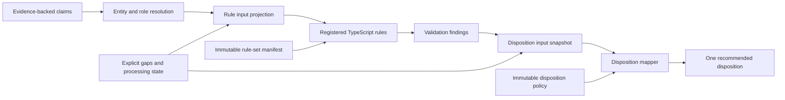

# Financial Document AI Agent Validation and Disposition Specification

Document ID: `VAL`

Version: 2.0.0

Status: Approved

Last updated: 2026-09-03

## 1. Purpose

This specification defines entity matching, the finite validation-rule plugin architecture, the five initial demonstration rules, validation findings, and deterministic recommended-disposition mapping.

These rules demonstrate cross-document consistency checks. They are not a German bank policy, credit decision, KYC decision, AML decision, or authorization for a core banking action.

## 2. Authority and Dependencies

This document owns:

1. Entity-comparison and constrained matching-opinion behavior.
2. The compiled TypeScript rule-plugin contract and versioned rule-set manifest.
3. Inputs, outcomes, and reason-code families for the five initial rules.
4. Finding-production invariants.
5. The deterministic disposition-policy contract and precedence.

Normative dependencies are:

1. [`../INDEX.md`](../INDEX.md) for finding and disposition vocabularies.
2. [`../PRODUCT_AND_SCOPE.md`](../PRODUCT_AND_SCOPE.md) for scenario, supported claims, and prohibited outcomes.
3. [`../SYSTEM_ARCHITECTURE.md`](../SYSTEM_ARCHITECTURE.md) for component authority and model boundaries.
4. [`../DATA_MODEL.md`](../DATA_MODEL.md) for claims, evidence, entities, assessments, findings, result revisions, and dispositions.
5. [`ADAPTIVE_EXTRACTION_AGENT.md`](ADAPTIVE_EXTRACTION_AGENT.md) for Agent authority limits.

`VAL-REQ-001` Validation must consume persisted, schema-valid claims, evidence state, entity-role assignments, matching assessments, extraction gaps, and processing state from one result-revision scope.

`VAL-REQ-002` Validation must not consume an unvalidated extraction candidate as though it were a claim.

`VAL-REQ-003` Rule evaluation and disposition mapping must be separate deterministic operations with separate versions and outputs.

`VAL-REQ-004` A model or Agent must not create, modify, activate, order, evaluate, or change the semantics of a rule or disposition policy at runtime.

`VAL-REQ-137` The Case Review Agent may read persisted finding and recommended-disposition projections for reporting, but its brief must not become an input to rule evaluation or disposition mapping and must not alter their records.

## 3. Validation Flow



`VAL-REQ-005` The same immutable input projection, rule implementation versions, manifest, and parameters must produce byte-equivalent canonical finding content excluding record identity, trace, and time metadata.

`VAL-REQ-006` The same canonical finding and processing-state snapshot with the same disposition-policy version must produce the same recommended disposition and reason codes.

`VAL-REQ-007` Validation must not read raw document bytes or ask a model to reinterpret source documents.

`VAL-REQ-008` Every material claim used by a rule must resolve to evidence meeting `DAT-REQ-068` through `DAT-REQ-078`.

## 4. Entity and Role Resolution

Initial person roles are:

```text
applicant
identity_holder
employee
account_holder
```

Initial organization roles are:

```text
declared_employer
payslip_employer
payment_counterparty
```

`VAL-REQ-009` Entity resolution must create case-local identity hypotheses and must not claim verification against an external identity authority.

`VAL-REQ-010` Entity comparison must operate on explicit claim and role references and must not merge records merely because normalized display strings are equal.

`VAL-REQ-011` Name comparison must preserve original values and use a versioned normalization pipeline over Unicode normalization, whitespace, punctuation, casing, configured honorifics, and token handling.

`VAL-REQ-012` Organization comparison must preserve original values and use a separately versioned normalization pipeline appropriate to organization names.

`VAL-REQ-013` Person-name and organization-name normalization must not share an undocumented generic normalization result.

`VAL-REQ-014` Deterministic comparison may use exact normalized equality, token or character similarity, and explicitly configured alias data.

`VAL-REQ-015` Similarity thresholds, ambiguity bands, required supporting claims, and comparison order must be schema-validated versioned configuration.

`VAL-REQ-016` A deterministic match, mismatch, ambiguous result, missing-input result, or unsupported-input result must remain explicit.

`VAL-REQ-017` A role assignment unresolved because evidence is missing or ambiguous must not be silently bound to the most similar entity.

`VAL-REQ-018` The current result revision must enforce the participant cardinality and unresolved-participant semantics in `DAT-REQ-181`.

## 5. Constrained LLM Matching Fallback

The allowed LLM matching opinions are:

```text
likely_same
likely_different
insufficient_information
```

`VAL-REQ-019` An LLM fallback may be requested only after deterministic comparison returns an explicitly configured ambiguous result.

`VAL-REQ-020` The fallback must receive only the minimum structured compared values, their roles, locale context, deterministic measurements, and task schema needed for the opinion.

`VAL-REQ-021` The fallback must not receive a complete case, unrelated claims, validation-rule outcome, disposition policy, or tools.

`VAL-REQ-022` The fallback must return exactly one allowed opinion plus schema-bounded reason features; free-form narrative must not be authoritative input.

`VAL-REQ-023` An LLM opinion must retain model, prompt, schema, invocation, and compared-claim provenance.

`VAL-REQ-024` An LLM opinion must not itself create an entity merge, role assignment, finding, or disposition.

`VAL-REQ-025` Versioned deterministic policy must translate deterministic measurements and any constrained LLM opinion into the entity-match assessment consumed by rules.

`VAL-REQ-026` `insufficient_information`, provider failure, timeout, schema failure, or unavailable model must preserve an unresolved assessment and must not become a match.

`VAL-REQ-027` Default continuous-integration tests must use a deterministic fake matching adapter and require no external model call.

## 6. Rule Plugin Architecture

`VAL-REQ-028` A validation rule must be a compiled TypeScript plugin registered explicitly at build time.

`VAL-REQ-029` V1 must not implement or execute a general-purpose rule DSL, runtime script, uploaded code, expression evaluator, or model-generated rule.

`VAL-REQ-030` Each registered plugin must declare a stable rule identifier, semantic version, input-schema version, parameter-schema version, possible statuses, reason codes, and implementation entry point.

`VAL-REQ-031` A rule plugin must expose a pure evaluation boundary over immutable validated input and parameters and must return a schema-valid finding proposal without performing I/O.

`VAL-REQ-032` A rule plugin must not access the database, object store, network, filesystem, clock, environment variables, model gateway, Agent, or another rule directly.

`VAL-REQ-033` Date-sensitive rules must receive an explicit reference date in their input projection rather than read the runtime clock.

`VAL-REQ-034` Arithmetic rules must use exact decimal arithmetic and must not delegate calculation to a model.

`VAL-REQ-035` Rule execution order must not affect rule outcomes; dependencies must be represented as input projections rather than reads of another rule's mutable output.

`VAL-REQ-036` One rule failure or exception must produce a structured evaluation failure for that rule and must not erase other committed findings.

`VAL-REQ-037` An exception must not be converted into `passed`, `not_applicable`, or an invented business result.

## 7. Rule-Set Registry and Manifest

`VAL-REQ-038` The Rule Registry must be an immutable runtime map of explicitly compiled and approved rule identifiers and versions.

`VAL-REQ-039` A versioned YAML or JSON rule-set manifest must select enabled registered rule versions and schema-valid parameters.

Example, non-normative:

```yaml
id: demo-de-personal-loan-v1
version: 1.0.0
rules:
  - id: VAL_DOC_COMPLETENESS_001
    implementationVersion: 1.0.0
    parameters:
      requiredDocumentTypes: [identity_document, payslip, bank_statement]
  - id: VAL_NAME_CONSISTENCY_001
    implementationVersion: 1.0.0
    parametersRef: name-comparison-v1
```

`VAL-REQ-040` The manifest must have stable identity, semantic version, schema version, canonical content hash, creation provenance, and ordered entries for presentation only.

`VAL-REQ-041` Unknown, duplicate, unregistered, inactive, incompatible, or schema-invalid rule entries must make manifest resolution fail closed.

`VAL-REQ-042` Manifest order must not create hidden rule dependencies or alter disposition precedence.

`VAL-REQ-043` A processing run must resolve and retain the immutable rule-set manifest version and hash before validation.

`VAL-REQ-044` Changing an enabled rule, implementation version, parameter, input schema, or reason-code semantics must create a new rule-set manifest version and require a new processing run for machine-baseline comparison.

`VAL-REQ-045` Runtime administration must not edit registry code, manifests, thresholds, or rule semantics through the Review Workbench or public API.

## 8. Finding Contract

`VAL-REQ-046` Each enabled rule must produce exactly one finding for the evaluated result revision unless a structured engine failure prevents a complete result revision from being sealed.

`VAL-REQ-047` A finding must use exactly one status: `passed`, `warning`, `failed`, `inconclusive`, or `not_applicable`.

`VAL-REQ-048` A finding must contain rule identifier and version, rule-set identity, result revision, input-snapshot identity, status, stable reason code, schema-valid reason parameters, and all material input links.

`VAL-REQ-049` Human-readable explanation must be deterministically rendered from reason code and parameters or stored as non-authoritative display content.

`VAL-REQ-050` Missing, insufficient-confidence, unresolved, foreign-currency, or incomparable input must produce an explicit `inconclusive` or `not_applicable` result according to rule semantics and must never be an implicit pass.

`VAL-REQ-051` `not_applicable` may be used only when the rule's declared applicability predicate is false, not when a required input is missing or processing failed.

`VAL-REQ-052` `warning` must indicate a completed evaluation whose condition requires attention but is not defined as a demonstrated conflict or required-input failure.

`VAL-REQ-053` `failed` must indicate that evaluated evidence violates the finite rule condition; it must not mean a customer or loan rejection.

`VAL-REQ-054` A finding must not include or imply creditworthiness, fraud guilt, document authenticity certification, final KYC, final AML, loan approval, or loan decline.

## 9. Initial Rule Set

### 9.1 `VAL_DOC_COMPLETENESS_001`

`VAL-REQ-055` Document completeness must compare the document types required by the immutable demonstration case manifest with current logical-document revisions and their usability state.

`VAL-REQ-056` Required document types for V1 may include supported identity document, payslip, and bank statement; this list demonstrates configured case completeness and must not be described as a real bank policy.

`VAL-REQ-057` The rule must return `passed` when every configured required type has at least one usable supported logical document.

`VAL-REQ-058` The rule must return `failed` with reason `required_document_missing` when a required type is absent from the submitted input revision.

`VAL-REQ-059` The rule must return `inconclusive` when a potentially present required document cannot be classified or used because its boundary, readability, or required processing state is unresolved.

`VAL-REQ-060` The rule must link each present, missing, uncertain, unsupported, or duplicate relevant document-type determination as structured input.

### 9.2 `VAL_NAME_CONSISTENCY_001`

`VAL-REQ-061` Name consistency must compare the applicant with available identity-holder, employee, and primary account-holder person roles.

`VAL-REQ-062` The rule must use persisted entity-match assessments produced under the configured person-name comparison policy.

`VAL-REQ-063` The rule must return `passed` when every required available role is deterministically resolved as the applicant under that policy.

`VAL-REQ-064` The rule must return `failed` with reason `person_name_conflict` when any required role is resolved as a different person with sufficient deterministic support.

`VAL-REQ-065` The rule must return `inconclusive` when a required role or supporting name claim is absent, insufficiently evidenced, or unresolved after allowed matching fallback.

`VAL-REQ-066` A configured explainable minor variation may produce `warning` only when the deterministic policy accepts the match but records a review-relevant normalization or similarity condition.

### 9.3 `VAL_EMPLOYER_CONSISTENCY_001`

`VAL-REQ-067` Employer consistency must compare declared-employer and payslip-employer roles and may compare salary-payment-counterparty when a qualified candidate exists.

`VAL-REQ-068` The rule must use persisted organization-match assessments produced under the configured organization comparison policy.

`VAL-REQ-069` The rule must return `passed` when required declared and payslip employer roles match and every qualified counterparty input is consistent under policy.

`VAL-REQ-070` The rule must return `failed` with reason `employer_conflict` when required employer roles or a qualified salary counterparty are determined to differ with sufficient support.

`VAL-REQ-071` The rule must return `inconclusive` when required employer input is missing or unresolved.

`VAL-REQ-072` Absence of an optional qualified payment-counterparty candidate must not by itself create an employer conflict; the manifest must declare whether that input is required for the evaluated case.

### 9.4 `VAL_INCOME_CONSISTENCY_001`

`VAL-REQ-073` Every income input must identify amount, exact decimal representation, currency, income basis, period or period normalization, role, evidence, and derivation provenance.

Initial income-basis values are:

```text
gross
net
account_credit
unspecified
```

`VAL-REQ-074` The rule must compare only values made comparable by a versioned policy over basis, period, role, and currency.

`VAL-REQ-075` The rule must not compare a declared amount with gross pay, net pay, or account credit until the declared basis is explicit or a deterministic approved transformation establishes comparable semantics.

`VAL-REQ-076` V1 validation must use EUR; a foreign-currency claim may be preserved but must not be converted by this rule.

`VAL-REQ-077` Permitted period normalization and aggregation must use exact decimal arithmetic, explicit source periods, and versioned deterministic formulas.

`VAL-REQ-078` Relative and absolute tolerances must be schema-valid manifest parameters with declared units and must not be inferred by a model.

`VAL-REQ-079` The rule must return `passed` when all required comparable values fall within configured tolerance.

`VAL-REQ-080` The rule must return `failed` with reason `income_conflict` when required comparable values exceed configured tolerance with sufficient evidence.

`VAL-REQ-081` The rule must return `inconclusive` when required input, basis, period, evidence, currency support, or qualified salary-credit derivation is missing or unresolved.

`VAL-REQ-082` `unspecified` income basis must not be coerced to `gross`, `net`, or `account_credit` by a model or display label.

`VAL-REQ-083` Salary-payment identification must remain a candidate until deterministic reconciliation or review qualifies it as rule input.

### 9.5 `VAL_ID_EXPIRY_001`

`VAL-REQ-084` Identity-document expiry must compare the normalized full expiry date with an explicit run reference date using deterministic calendar logic.

`VAL-REQ-085` The run reference date and timezone policy must be fixed in the validation input snapshot.

`VAL-REQ-086` The rule must return `passed` when the supported identity document expires on or after the configured valid-through boundary.

`VAL-REQ-087` The rule must return `failed` with reason `identity_document_expired` when the expiry date is before that boundary.

`VAL-REQ-088` The rule must return `inconclusive` when a required expiry claim is absent, partial, unparseable, unsupported, insufficiently evidenced, or attached to an unresolved identity-holder role.

`VAL-REQ-089` This rule must not claim document authenticity, biometric match, issuer verification, revocation status, or legal identity validation.

## 10. Disposition Policy

The only recommended dispositions are:

```text
ready_for_downstream_processing
additional_documents_needed
human_review_required
```

Precedence is:

```text
additional_documents_needed
  > human_review_required
  > ready_for_downstream_processing
```

`VAL-REQ-090` The mapper must consume a versioned snapshot of findings, required extraction-gap state, required stage state, manifest resolution, and processing or security failures.

`VAL-REQ-091` The mapper must not read raw document content, extraction candidates, model narratives, or unregistered reason strings.

`VAL-REQ-092` A disposition policy must have stable identity, semantic version, schema version, canonical hash, rule mappings, precedence, and creation provenance.

`VAL-REQ-093` A blocking technical or security failure, invalid required contract, unresolved manifest, or required processing failure must fail the processing run before disposition creation.

`VAL-REQ-094` `additional_documents_needed` must be selected when no higher-precedence blocker exists and a completeness finding establishes that a required document is absent from the submitted input.

`VAL-REQ-095` `human_review_required` must be selected when no higher-precedence condition exists and at least one configured conflict, warning requiring review, inconclusive rule, unresolved required extraction gap, uncertain boundary, ambiguous entity match, or unsupported validation currency remains.

`VAL-REQ-096` `ready_for_downstream_processing` must be selected only when the required stages succeeded, every enabled rule produced a complete acceptable finding under policy, no required gap remains, and no higher-precedence condition exists.

`VAL-REQ-097` A missing submitted document must use `additional_documents_needed`; inability to process a submitted required document must either route to `human_review_required` when a reliable reviewable result exists or fail the run when it does not.

`VAL-REQ-098` A `failed` validation finding representing a cross-document conflict must not map to a workflow failure or customer rejection; V1 policy must route it to `human_review_required`.

`VAL-REQ-099` `not_applicable` may be acceptable for ready disposition only when the manifest declares that rule non-applicable and all required rules and evidence remain complete.

`VAL-REQ-100` Changing mapping conditions, precedence, reason-code handling, or acceptable finding combinations must create a new disposition-policy version.

`VAL-REQ-101` Exactly one disposition must be created when a complete result revision is sealed.

`VAL-REQ-102` A disposition reason must list the controlling policy conditions and references without introducing a model-generated business judgment.

`VAL-REQ-103` No disposition value or reason may authorize loan approval, loan rejection, account opening, disbursement, customer contact, or final AML or KYC action.

## 11. Review Re-evaluation

`VAL-REQ-104` A human correction must not modify a sealed machine-baseline finding or disposition.

`VAL-REQ-105` Review re-evaluation must construct a new immutable result revision over explicit corrected claim selections and the prior run's unchanged version manifest.

`VAL-REQ-106` Every rule must be evaluated for the new result revision even when only one corrected claim changed, unless a future approved incremental-evaluation contract proves equivalent complete output.

`VAL-REQ-107` Findings and disposition in the review result revision must link to their corrected effective-input snapshot and predecessor result revision.

`VAL-REQ-108` A review correction must not change rule code, parameters, matching thresholds, disposition policy, or golden truth.

## 12. Failure, Idempotency, and Persistence

`VAL-REQ-109` Rule input projection, rule evaluation, finding persistence, disposition mapping, and result-revision sealing must expose distinct structured failures.

`VAL-REQ-110` An invalid manifest, missing registered plugin, incompatible schema, rule exception, invalid finding, or incomplete enabled-rule set must prevent result-revision sealing.

`VAL-REQ-111` Validation retry with unchanged run, result-revision intent, input snapshot, rule set, and policy must use a deterministic idempotency identity.

`VAL-REQ-112` A retry must not create duplicate authoritative findings or dispositions and must not overwrite a prior attempt.

`VAL-REQ-113` Findings and disposition must be committed with the complete result revision atomically as required by `DAT-REQ-176`.

`VAL-REQ-114` Partial unsealed evaluation output may be retained for safe diagnostics but must not be presented as the authoritative current result revision.

## 13. Observability and Safe Explanation

`VAL-REQ-115` Validation telemetry must correlate case, run, result revision, rule set, rule, disposition policy, stage attempt, and trace identifiers.

`VAL-REQ-116` Metrics must include rule outcomes, rule evaluation failures, missing-input and inconclusive rates, matching fallback use, disposition outcomes, and evaluation duration.

`VAL-REQ-117` Logs, traces, metrics, reason parameters, and explanations must not expose complete documents, page images, full identity-document numbers, full IBANs, or unrestricted extracted text.

`VAL-REQ-118` Explanation must identify compared roles, safe value representations, evidence references, deterministic measurements, rule version, status, and controlling disposition reasons as applicable.

`VAL-REQ-119` Explanation must distinguish deterministic match results from constrained LLM opinions and must not describe model opinion as verified fact.

`VAL-REQ-120` Reported validation and disposition quality must reference dataset, truth, rule-set, policy, component, and runtime versions.

## 14. Acceptance Criteria

The component is acceptable for implementation when automated tests demonstrate that:

`VAL-REQ-121` Registry and manifest tests reject unknown, duplicate, inactive, incompatible, and schema-invalid rule entries.

`VAL-REQ-122` Rule purity tests prevent clock, database, filesystem, network, model, Agent, and cross-rule access from rule evaluation.

`VAL-REQ-123` Every enabled rule produces exactly one schema-valid evidence-linked finding in a complete result revision.

`VAL-REQ-124` Missing or insufficient inputs never produce an implicit pass.

`VAL-REQ-125` Deterministic person and organization matching handles fixed exact, normalized, mismatch, and ambiguous fixtures with preserved original values.

`VAL-REQ-126` Only ambiguous configured fixtures invoke the constrained LLM fallback, and its opinion cannot directly produce a finding or disposition.

`VAL-REQ-127` Completeness fixtures distinguish missing documents from present but unprocessable or uncertain documents.

`VAL-REQ-128` Name fixtures compare applicant, identity-holder, employee, and account-holder roles and preserve unresolved roles.

`VAL-REQ-129` Employer fixtures compare declared employer, payslip employer, and qualified payment counterparty without requiring an optional counterparty silently.

`VAL-REQ-130` Income fixtures reject incomparable gross, net, account-credit, period, and currency combinations and use exact decimals for comparable values.

`VAL-REQ-131` Identity-expiry fixtures use an explicit fixed reference date and do not depend on the test machine clock.

`VAL-REQ-132` Disposition fixtures prove the declared precedence and distinguish absent documents, processing failures, validation conflicts, human-review conditions, and ready results.

`VAL-REQ-133` Repeating identical evaluation inputs produces equivalent findings and disposition without duplicate authoritative records.

`VAL-REQ-134` A human correction creates a new sealed result revision while preserving the machine-baseline findings and disposition.

`VAL-REQ-135` Instruction-like document content and constrained model output cannot modify registry, manifest, rules, thresholds, findings, policy, precedence, or disposition vocabulary.

`VAL-REQ-136` No rule or disposition fixture produces a lending, account, customer-contact, final AML, or final KYC action.

## 15. Assumptions and Deferred Evidence

1. V1 evaluates one synthetic applicant, one primary account holder, and at most one current employer.
2. Demonstration case manifests, rules, thresholds, and tolerances are illustrative and not a German bank's policy.
3. Exact person-name thresholds, organization-name thresholds, income tolerances, qualified salary-payment logic, and warning conditions require golden-set evidence and remain in [`../../BACKLOG.md`](../../BACKLOG.md).
4. Golden truth and validation-quality measurement belong to `ML_PIPELINE_AND_EVALUATION.md`.
5. Rule and disposition manifests are Git-managed immutable artifacts; runtime registry administration is outside V1.

No unresolved validation-authority or disposition-semantics decision blocks review of this document.

## 16. Document History

| Version | Date | Status | Change |
|---|---|---|---|
| 2.0.0 | 2026-09-04 | Approved | Removed `processing_blocked` as a disposition; unrecoverable technical and security blockers now fail the processing run before disposition creation. |
| 1.1.0 | 2026-09-04 | Approved | Clarified that Agent review briefs may summarize but never influence deterministic findings or disposition mapping. |
| 1.0 | 2026-09-03 | Approved | Approved entity matching, finite rule plugins, five demonstration rules, findings, and deterministic disposition mapping. |
